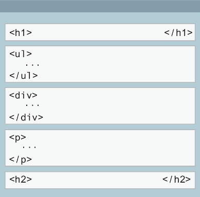
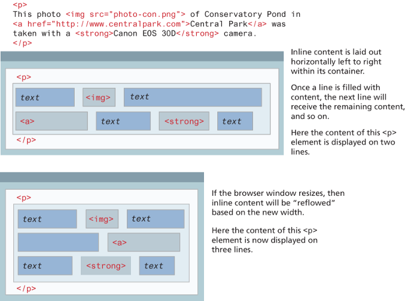
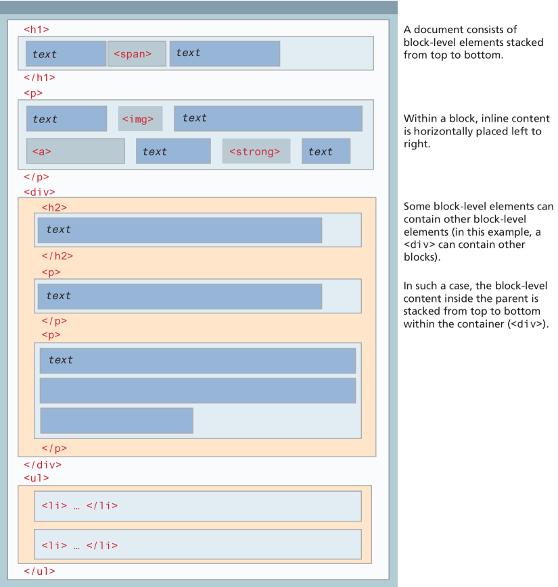
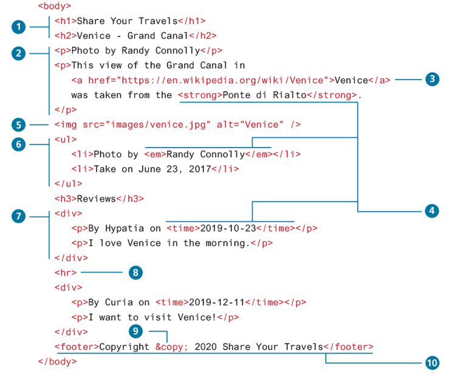
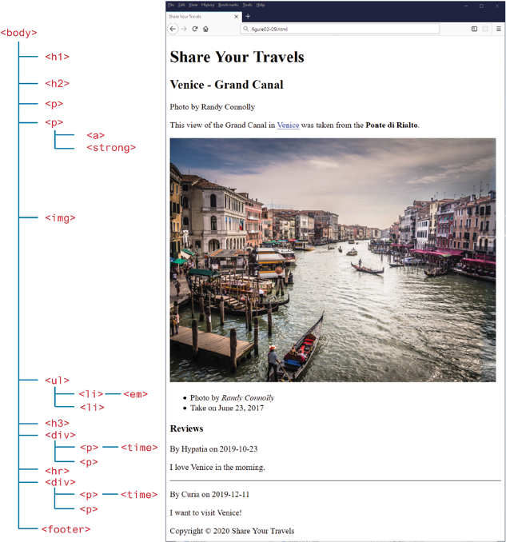

<!-- markdownlint-disable MD032 -->
<!-- markdownlint-disable MD033 -->
<!-- markdownlint-disable MD045 -->
# HTML Basics 2

For this week, we'll focus on how to manage files effectively, understand different graphics formats, and use anchor tags with images. These skills are essential for creating well-organized and visually appealing websites.

[L3](labs/L3.md ':include')

## Table of Contents

- [HTML Basics 2](#html-basics-2)
  - [Table of Contents](#table-of-contents)
  - [File Management](#file-management)
    - [File Naming](#file-naming)
    - [File Structure](#file-structure)
  - [Visual Graphics](#visual-graphics)
    - [Graphics Format](#graphics-format)
    - [Lossy vs Lossless Compression](#lossy-vs-lossless-compression)
  - [Anchor Tags with Images](#anchor-tags-with-images)
  - [HTML Favicon](#html-favicon)
  - [Block vs Inline Elements](#block-vs-inline-elements)
    - [Block Elements](#block-elements)
    - [Inline Elements](#inline-elements)
    - [Block \& Inline In Action](#block--inline-in-action)
  - [HTML Validation](#html-validation)
  - [Review of HTML Basics](#review-of-html-basics)

The videos below provide an overview of the topics for this week. You can watch the videos before or after reading the content for this week.

<!-- File Paths on the Web -->
<iframe width="560" height="315" src="https://www.youtube.com/embed/G5Ozk5ahXrg?si=s-YXGaUIpxQULKdy" title="YouTube video player" frameborder="0" allow="accelerometer; autoplay; clipboard-write; encrypted-media; gyroscope; picture-in-picture; web-share" referrerpolicy="strict-origin-when-cross-origin" allowfullscreen></iframe>

<!-- What is the Best Image Format? -->
<iframe width="560" height="315" src="https://www.youtube.com/embed/M247l1LktG8?si=YxpYGjqbL4U9DKs7" title="YouTube video player" frameborder="0" allow="accelerometer; autoplay; clipboard-write; encrypted-media; gyroscope; picture-in-picture; web-share" referrerpolicy="strict-origin-when-cross-origin" allowfullscreen></iframe>

<!-- HTML Block vs Inline Elements -->
<iframe width="560" height="315" src="https://www.youtube.com/embed/XHjoohto2-w?si=Pws70zUgObdHOwu4" title="YouTube video player" frameborder="0" allow="accelerometer; autoplay; clipboard-write; encrypted-media; gyroscope; picture-in-picture; web-share" referrerpolicy="strict-origin-when-cross-origin" allowfullscreen></iframe>

<!-- favicon -->
<iframe width="560" height="315" src="https://www.youtube.com/embed/kEf1xSwX5D8?si=Wodo7xtmOFA6W3Kl" title="YouTube video player" frameborder="0" allow="accelerometer; autoplay; clipboard-write; encrypted-media; gyroscope; picture-in-picture; web-share" referrerpolicy="strict-origin-when-cross-origin" allowfullscreen></iframe>

<!-- HTML validator -->
<iframe width="560" height="315" src="https://www.youtube.com/embed/BTOCB-CusmY?si=Hvqfn7Fkio9-iCcg" title="YouTube video player" frameborder="0" allow="accelerometer; autoplay; clipboard-write; encrypted-media; gyroscope; picture-in-picture; web-share" referrerpolicy="strict-origin-when-cross-origin" allowfullscreen></iframe>

## File Management

Proper file management is crucial in web development to keep your projects organized and maintainable. Think of your website as a large office building. File management is like organizing the offices, files, and folders in a way that everyone can find what they need easily.

### File Naming

- **Descriptive Names**: Use names that clearly indicate the file's content. It's like labeling folders in a filing cabinet.
- **Conventions**: Stick to lowercase letters, numbers, and hyphens. Avoid spaces and special characters to avoid confusion and ensure compatibility.
- **Examples**:
  - `index.html` (main page)
  - `about-us.html` (about page)
  - `styles.css` (stylesheet)

### File Structure

- **Organize Files**: Group related files into directories (folders), just like you would organize documents in different drawers or cabinets.

- **Example Structure**:

```plaintext
website-folder/
├── index.html
├── about.html
├── CSS/
│   └── styles.css
├── Images/
│   ├── logo.png
│   └── banner.jpg
└── Reports/
    └── HTML-Validation.pdf
    └── CSS-Validation.pdf
```

Here area 2 great resources for learning more about file management and paths:
- [https://learntheweb.courses/topics/paths-folders](https://learntheweb.courses/topics/paths-folders/).
- [https://www.kirupa.com/html5/all_about_file_paths](https://www.kirupa.com/html5/all_about_file_paths.htm)

<!-- > [!ATTENTION|iconVisibility:hidden]
> For your quizzes, you'll be required to submit a zip file containing your HTML, CSS, and Image files. Make sure to organize your files properly before submission. -->

This structure helps in logically separating HTML, CSS, Images, and Report files, making it easier to find and update them.

## Visual Graphics

Understanding different graphics formats and compression techniques is important for optimizing web performance. Think of image formats as different types of packaging for products. Some are lightweight but may lose some quality (like a plastic bag), while others are heavier but keep everything intact (like a sturdy box).

### Graphics Format

- **JPEG** (.jpg): Best for photographs. Uses lossy compression which reduces file size by removing some data. Think of it as shrinking a file by taking out less important details.

- **PNG** (.png): Ideal for images with transparency. Uses lossless compression, preserving quality. Like a clear box that shows exactly what’s inside.
- **GIF** (.gif): Suitable for simple animations. Also uses lossless compression. Imagine a flipbook with simple moving images.
- **SVG** (.svg): Scalable vector graphics. Uses lossless compression and is resolution-independent. It’s like a vector image that can be zoomed in or out without losing quality.


### Lossy vs Lossless Compression

Think of compression as packing clothes for a trip. You can either compress them to save space (but with some wrinkles) or use a vacuum-sealer to keep them wrinkle-free. This analogy applies to image compression as well. There are two types of compression techniques:

- **Lossy Compression**: Reduces file size by removing data, which can slightly degrade image quality (e.g., JPEG). Like compressing clothes into a smaller suitcase but with some wrinkles.
- **Lossless Compression**: Compresses files without losing quality (e.g., PNG, GIF, SVG). Like vacuum-sealing clothes to save space without any wrinkles.

## Anchor Tags with Images

You can make images clickable by wrapping them in anchor tags, similar to putting a clickable sticker on a picture. This is useful for creating image galleries, linking to other pages, or adding interactive elements to your website. Most often you'll see this used for logos or banners that link back to the homepage.

The example below shows how to create a clickable image that links to a website:
  
> [!TIP]
> Click on the `Result` tab to see the output and edit the code using the `Edit in JSFiddle` button.

<iframe width="100%" height="300" src="//jsfiddle.net/parsar/c4s1u27g/7/embedded/html,result/dark/" allowfullscreen="allowfullscreen" allowpaymentrequest frameborder="0"></iframe>

## HTML Favicon

Favicons are small icons displayed in the browser tab, helping users to identify your website quickly. It's like having a unique logo on the tab of your browser, making it easy to recognize.

```html
<link rel="icon" href="images/favicon.ico" type="image/x-icon">
```

The example below shows how to add a favicon to your website:
  
> [!TIP]
> Click on the `Result` tab to see the output and edit the code using the `Edit in JSFiddle` button.

<iframe width="100%" height="300" src="//jsfiddle.net/parsar/u25hr94m/2/embedded/html,result/dark/" allowfullscreen="allowfullscreen" allowpaymentrequest frameborder="0"></iframe>

This adds a favicon to your website, using the favicon.ico file located in the images directory. It's like putting a logo sticker on your browser tab.

## Block vs Inline Elements

Within web development, there are two types of element boxes: [1] block level and [2] inline boxes.

Understanding the difference between block and inline elements helps in structuring your HTML content effectively. Think of block elements as large boxes that take up a whole row and inline elements as small boxes that fit within a line of text.


### Block Elements

- Block elements take up the full width available and start on a new line, like a large piece of furniture that occupies an entire row.
- Because block-level elements begin with a line break (that is, they start on a new line), without styling, two block-level elements can’t exist on the same line.

Some examples: `<div>`, `<ul>`, `<p>`, `<section>`, headings (`<h1>`, `<h2>`, etc.)



By default each block-level element fills up the entire width of its parent (in this case, it is the `<body>`, which is equivalent to the width of the browser window).

### Inline Elements

- Inline elements do not form their own blocks but instead are displayed within lines.
- These elements only take up as much width as necessary and do not start on a new line, like smaller items that fit within a shelf.
- When there isn’t enough space left on the line, the content moves to a new line

Some examples: `<span>`, `<a>`, `<em>`, ``



### Block & Inline In Action



The example below shows how block and inline elements are displayed in HTML:
  
> [!TIP]
> Click on the `Result` tab to see the output and edit the code using the `Edit in JSFiddle` button.

<iframe width="100%" height="500" src="//jsfiddle.net/parsar/wgedyoxa/7/embedded/html,result/dark/" allowfullscreen="allowfullscreen" allowpaymentrequest frameborder="0"></iframe>

## HTML Validation

- Validation is your first step in debugging and ensuring your code is error-free.
- An HTML validator checks your code against web standards (W3C) to ensure it's well-structured and compatible with different browsers.
- The benefits of validation include improved code quality, better accessibility, and consistent rendering across browsers.
- W3C HTML Validator tool: [https://validator.w3.org/](https://validator.w3.org/)

## Review of HTML Basics

Let's review some of the basic HTML elements and concepts we've covered so far. You should be familiar with these elements to create structured and meaningful web pages.



1. **Headings**: Describes the main structure of document. There are six levels of headings.
2. **Paragraphs**: The basic unit of text in HTML. As block-level elements, browsers typically add  newlines before and after the element.
3. **Link**: Hyperlinks are essential feature of all web pages and can reference another page or another location in same page.
4. **Inline Text Elements**: These do not change the flow of text and provide more information about text.
5. **Image**: Used to display an image by specifying a filename or URL
6. **Unordered List**: Used to display a bulleted list. Within a list is a collection of list item  elements.
7. **Division**: Container for text or other HTML elements. Like paragraphs, they are also block-level elements
8. **Horizontal Rule**: Indicates a thematic break in the text. Usually displayed as a horizontal line.
9. **Character Entity**: The mechanism for including special symbols (such as ©) or characters that have a reserved meaning in HTML.
10. **Semantic Block Element**: Special containers in HTML5 for describing structural elements in a document.

After rendering the above code, the output will look like this:



You may be wondering why this page look so... plain. Well, plain HTML is just that - plain. To make our web pages visually appealing, we need to add CSS (Cascading Style Sheets) to style our HTML elements. We'll cover CSS in more detail in the [next section](week-5-2.md).
