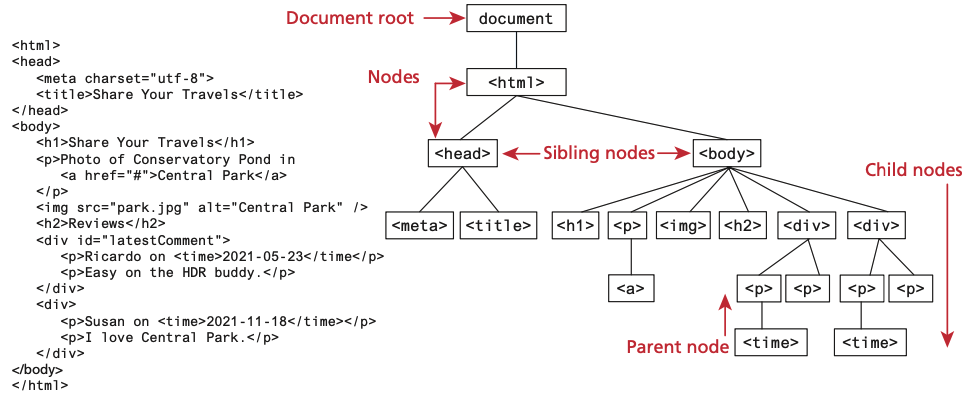
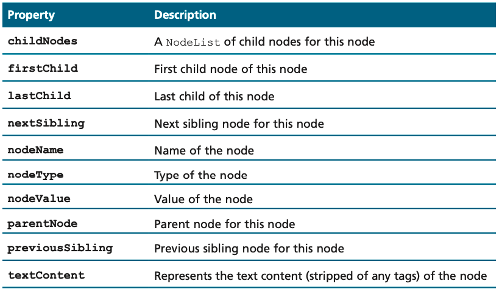
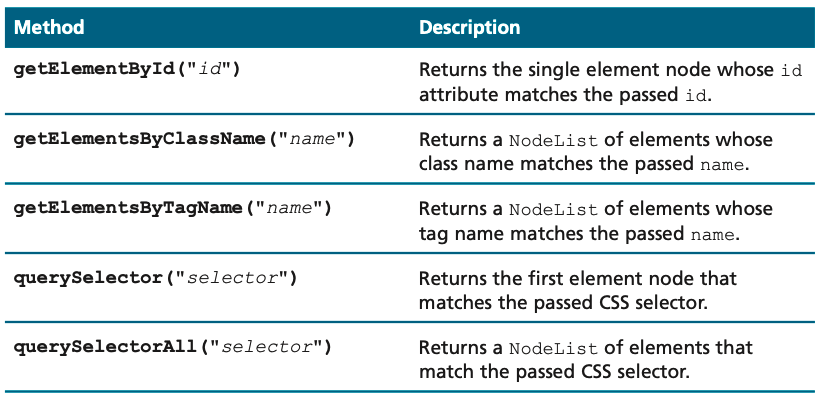
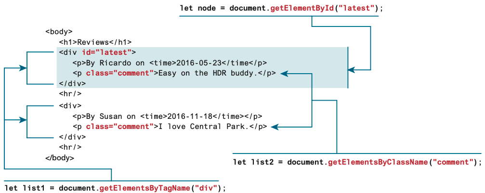
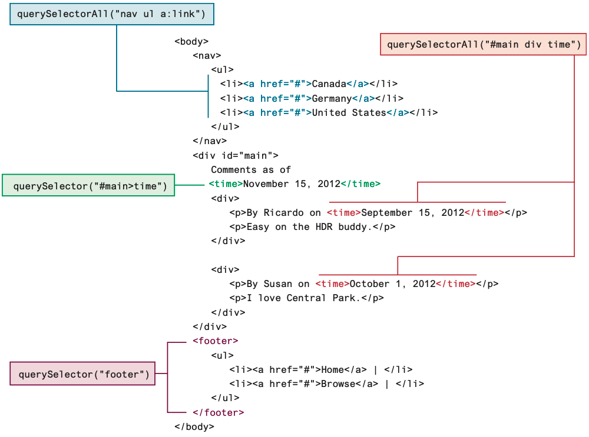
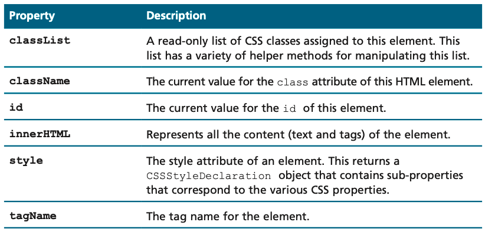
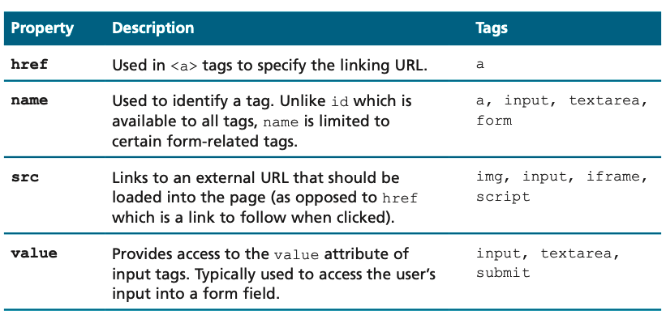
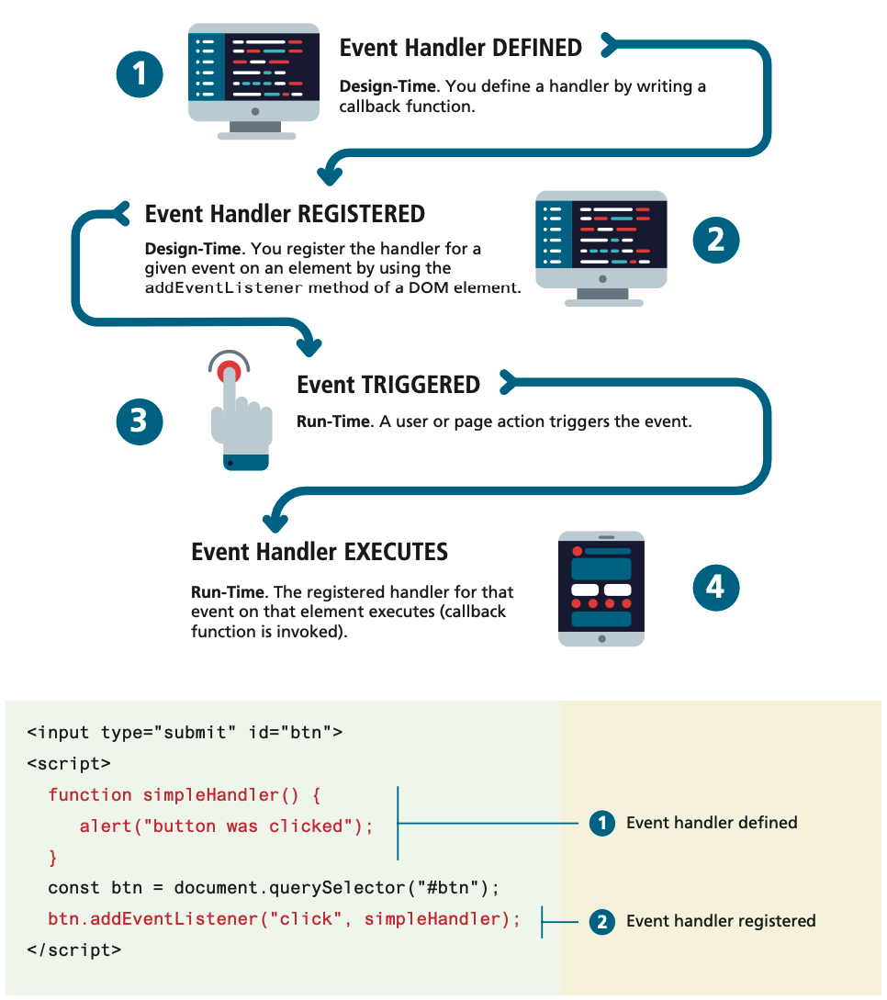
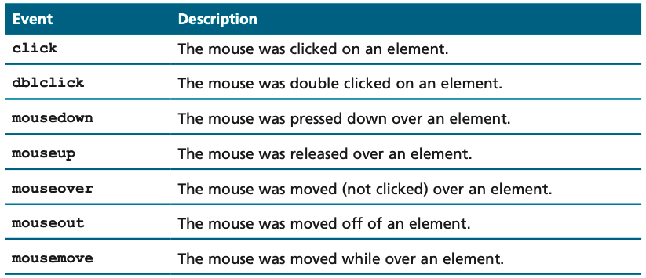
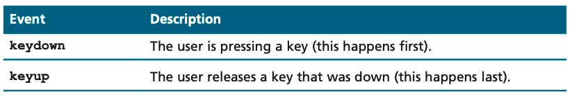

<!-- markdownlint-disable -->
# Intro to DOM 

As part of this lesson, we'll cover the basics of JavaScript and jQuery. JavaScript is a programming language that is used to create interactive effects within web browsers. jQuery is a JavaScript library that simplifies the process of writing JavaScript code.

## Table of Contents

- [Intro to DOM](#intro-to-dom)
  - [Table of Contents](#table-of-contents)
  - [The Document Object Model (DOM)](#the-document-object-model-dom)
    - [DOM Nodes](#dom-nodes)
    - [Document Object](#document-object)
    - [Selection Methods](#selection-methods)
    - [Element Node Object](#element-node-object)
  - [JavaScript Events](#javascript-events)
    - [Event Types](#event-types)
      - [Pop-up Events](#pop-up-events)
      - [Mouse Event](#mouse-event)
      - [Keyboard Event](#keyboard-event)
    - [Event Handlers](#event-handlers)
      - [Assigning Event Handlers](#assigning-event-handlers)
      - [HTML Event Attributes](#html-event-attributes)
      - [DOM Property](#dom-property)
      - [addEventListener Method](#addeventlistener-method)
    - [Example: Handling a Button Click](#example-handling-a-button-click)
    - [Event Object](#event-object)
    - [Preventing Default Behavior](#preventing-default-behavior)


The videos below provide an overview of the topics for this week. You can watch the videos before or after reading the content for this week.

- [Learn DOM Manipulation [18:36]](https://youtu.be/y17RuWkWdn8?si=UiOnx_TyCTt-L6Q2)
- [Overview of JavaScript Events [15:11]](https://youtu.be/YiOlaiscqDY?si=APtfG7yJg9CqC5L9t)


## The Document Object Model (DOM)

While JavaScript is now used in a variety of different contexts, by far the most com- mon is the browser. Within the browser context, JavaScript needs a way to interact with the HTML document in which it is contained. As such, there needs to be some way of programmatically accessing the elements and attributes within the HTML.

According to the W3C, the DOM is a
> platform- and language-neutral interface that will allow programs and scripts to dynamically access and update the content, structure and style of documents.
>

We already know all about the DOM, but by another name. The tree structure from earlier in the course is formally called the **DOM Tree** with the root, or topmost object called the **Document Root**. You already know how to specify the style of documents using CSS; with JavaScript and the DOM, you now can do so dynamically as well at runtime, in response to user events. Thus, we can summarize and say that the DOM provides a standardized, hierarchical (tree-like) way to access and manipulate the contents of an HTML document.



### DOM Nodes

In the DOM, each element within the HTML document is called a **node**. If the DOM is a tree, then each node is an individual branch. As can be seen in the example below, there are element nodes and text nodes (plus a few other uncommonly encountered ones). 


All nodes in the DOM share a common set of properties and methods. These properties and methods allow you to retrieve information about the node, manipulate its properties (for instance, changing its CSS properties or retrieving its text content), and even create new content. Some of these properties are available to all nodes; others are only available to, for instance, element nodes. Furthermore, depending on the element, some nodes will have specific properties for the specific element. The table below lists some of the more important properties that all nodes, regardless of type, share.

### Document Object 

The DOM document object is the root JavaScript object representing the entire HTML document. It contains some properties and methods that we will use extensively in our development and is globally accessible via the document object reference.



The properties of this document object cover a wide-range of information about the page. Some of these are read-only, but others are modifiable. Like any other JavaScript object, you can access its properties using either dot notation or square bracket notation, as illustrated in the following example:

```javascript
 // retrieve the URL of the current page
let a = document.URL;
// retrieve the page encoding, for example ISO-8859-1 
let b = document["inputEncoding"];
```

In addition to these properties, there are several essential methods you will use all the time. The last chapter introduced you to one of these, the `document.write()` method. To help us better familiarize ourselves with this object, we will group the methods into these three categories:

- Selection methods
- Family manipulation methods Event methods
- We will cover each of these in the next several sections.



### Selection Methods

The most important DOM methods are those that allow you to select one or more document elements; they are shown above. The relationship between the first three methods is shown below. The method `getElementById()` is perhaps the most commonly used of these selection methods. It returns a single DOM Element (covered as follows) that matches the id passed as an argument. 




Selectors are a powerful mechanism for selecting elements in CSS. `querySelector()` and `querySelectorAll()` are two methods that allow you to use CSS selectors to select elements in the DOM. The `querySelector()` method returns the first element that matches a specified CSS selector, while the `querySelectorAll()` method returns a collection of all elements that match a specified CSS selector. The example below demonstrates how to use these methods:



### Element Node Object

The type of object returned by the methods `getElementById()` and `querySelector()` described in the previous section is an **Element Node object**. This represents an HTML element in the hierarchy, contained between the opening `<>` and closing `</>` tags for this element. As you may already have figured out, an element can itself contain more elements. Every element node has the node properties shown below. It also has a variety of additional properties, the most important of which are shown in the following tables:

```html
<p id="here">hello <span>there</span></p>
<ul>
    <li>France</li>
    <li>Spain</li>
    <li>Thailand</li>
</ul>
<div id="main">
<a href="somewhere.html"></a> </div>
<script>
const node = document.getElementById("here"); // outputs: hello <span>there</span> console.log(node.innerHTML);
// outputs: hello there console.log(node.textContent);
    const items = document.getElementsByTagName("li");
    for (let i=0; i<items.length; i++) {
        // outputs: France, then Spain, then Thailand
        console.log(items[i].textContent);
    }
    const link = document.querySelector("#main a");
    // outputs: somewhere.html
    console.log(link.href);
    const img = document.querySelector("#main img");
    // outputs: whatever.gif
    console.log(img.src);
    // outputs: thumb
    console.log(img.className);
</script>
```
<!-- FUTURE TODO: Remove For loop example above -->







## JavaScript Events

Events are an essential part of almost all real-world JavaScript programming. The example below illustrates the four steps involved in JavaScript event processing. You begin by **defining** an event handler which is simply a callback function. That handler is then **registered** with a specific event for a specific element. From a programming perspective, that’s it. The next steps occur at runtime: the specific event is **triggered**, usually by some user action, and then the handler finally **executes**.





The example also illustrates the coding involved in implementing a simple event handler. Notice that an event handler is first defined, then registered to an element node object.

Registering an event handler requires passing a **callback** function to the `addEventListener()` method of a single node object. The callback function is executed when the event is triggered. The example below demonstrates how to register an event handler for a button click event in 3 different ways:

```javascript
const btn = document.getElementById("btn");
btn.addEventListener("click", function () {
    alert("used an anonymous function");
});

document.querySelector("#btn").addEventListener("click", function () {
    alert("a different approach but same result");
});

document.querySelector("#btn").addEventListener("click", () => {
   alert("arrow syntax but same result");
});
```


### Event Types

There are many different types of events that can be triggered in the browser. Perhaps the most obvious event is the click event, but JavaScript and the DOM support several others. In actuality, there are several classes of event, with several types of events within each class specified by the W3C. Some of the most commonly used **event types** are mouse events, keyboard events, touch events, form events, and frame events.

#### Pop-up Events

JavaScript provides three types of pop-up boxes: `alert`, `confirm`, and `prompt`. These pop-ups are used to interact with the user, gather input, and display information. They are simple to use and provide basic ways to communicate with the user.

#### Mouse Event

Mouse events are defined to capture a range of interactions driven by the mouse. These can be further categorized as mouse click and mouse move events. The table below lists some of the possible events one can listen for from the mouse.

Interestingly, many mouse events can be sent at a time. The user could be moving the mouse off of one `<div>` and onto another in the same moment, triggering `mouseon` and `mouseout` events as well as the `mousemove` event. 




#### Keyboard Event

Keyboard events are often overlooked by novice web developers, but are important tools for power users. The table below lists the most common keyboard events.



These events are most useful within input fields. We could, for example, validate an email address, or send an asynchronous request for a dropdown list of suggestions with each key press.

We could listen to key press events for an input box with an `id` of `key` and echo each pressed key back to the user as shown below 


```javascript
document.getElementById("key").addEventListener("keydown",
  function (e) {
    // get the raw key code
    let keyPressed=e.key;
    // convert to string
    let character=String.fromCharCode(keyPressed); 
    alert("Key " + character + " was pressed");
});
```

### Event Handlers

Event handlers are functions that are executed in response to an event. An event handler is embedded in an HTML tag as an `attribute` and indicates some JavaScript code to execute when the event occurs. Event handlers use the event name with the prefix “on”. The table below shows the event handlers that correspond to the events described earlier. 

For example, the `onload` event is triggered when browser renders (loads) a web page. When you move your mouse pointer over a text hyperlink, a `mouseover` event occurs and is detected by the browser. If that hyperlink contains an ​ `onmouseover event handler`, the JavaScript code indicated by the event handler will execute. This code might pop up an alert message, display an image, or display a menu. Other event handlers such as `onclick` and `onmouseout` can cause JavaScript code to ​execute when their corresponding event occurs.

| Event        | Description                                                      | Event Handler     |
|--------------|------------------------------------------------------------------|-------------------|
| `click`      | Occurs when the user clicks on an element                        | `onclick`         |
| `mouseover`  | Occurs when the user moves the mouse pointer over an element     | `onmouseover`     |
| `mouseout`   | Occurs when the user moves the mouse pointer out of an element   | `onmouseout`      |
| `keydown`    | Occurs when the user presses a key on the keyboard               | `onkeydown`       |
| `keyup`      | Occurs when the user releases a key on the keyboard              | `onkeyup`         |
| `load`       | Occurs when the page or an image has finished loading            | `onload`          |
| `unload`     | Occurs when the user leaves the page                             | `onunload`        |
| `submit`     | Occurs when a form is submitted                                  | `onsubmit`        |

#### Assigning Event Handlers

Event handlers can be assigned in three main ways:

1. **HTML Event Attributes**
2. **DOM Property**
3. **addEventListener Method**

#### HTML Event Attributes

You can assign an event handler directly in the HTML element using an attribute. Here’s an example:

```html
<button onclick="alert('Button clicked!')">Click me</button>
```

#### DOM Property

You can also assign an event handler using the DOM property of the element. This method is often preferred because it keeps the HTML and JavaScript separate:

```javascript
let button = document.getElementById('myButton');
button.onclick = function() {
  alert('Button clicked!');
};
```

#### addEventListener Method

The `addEventListener` method allows you to assign multiple event handlers to the same event on the same element. It’s the most versatile and recommended approach:

```javascript
let button = document.getElementById('myButton');
button.addEventListener('click', function() {
  alert('Button clicked!');
});
```

### Example: Handling a Button Click

Here’s a complete example of handling a button click event using the `addEventListener` method:

```html
<!DOCTYPE html>
<html lang="en">
<head>
  <meta charset="UTF-8">
  <meta name="viewport" content="width=device-width, initial-scale=1.0">
  <title>Event Handling Example</title>
  <script>
    document.addEventListener('DOMContentLoaded', function() {
      let button = document.getElementById('myButton');
      button.addEventListener('click', function() {
        alert('Button clicked!');
      });
    });
  </script>
</head>
<body>
  <button id="myButton">Click me</button>
</body>
</html>
```

In this example, an event listener is added to the button with the ID `myButton`. When the button is clicked, an alert message is displayed.

### Event Object

When an event occurs, an event object is automatically created and passed to the event handler function. This object contains useful information about the event, such as the type of event, the element that triggered the event, and the position of the mouse.

```javascript
let button = document.getElementById('myButton');
button.addEventListener('click', function(event) {
  console.log('Event type:', event.type);
  console.log('Element that triggered the event:', event.target);
});
```

In this example, when the button is clicked, information about the event is logged to the console.

### Preventing Default Behavior

Sometimes, you might want to prevent the default behavior of an event. For example, you might want to prevent a form from being submitted when a button is clicked. You can do this using the `preventDefault` method of the event object:

```javascript
let form = document.getElementById('myForm');
form.addEventListener('submit', function(event) {
  event.preventDefault();
  alert('Form submission prevented.');
});
```

In this example, the form submission is prevented, and an alert message is displayed instead.