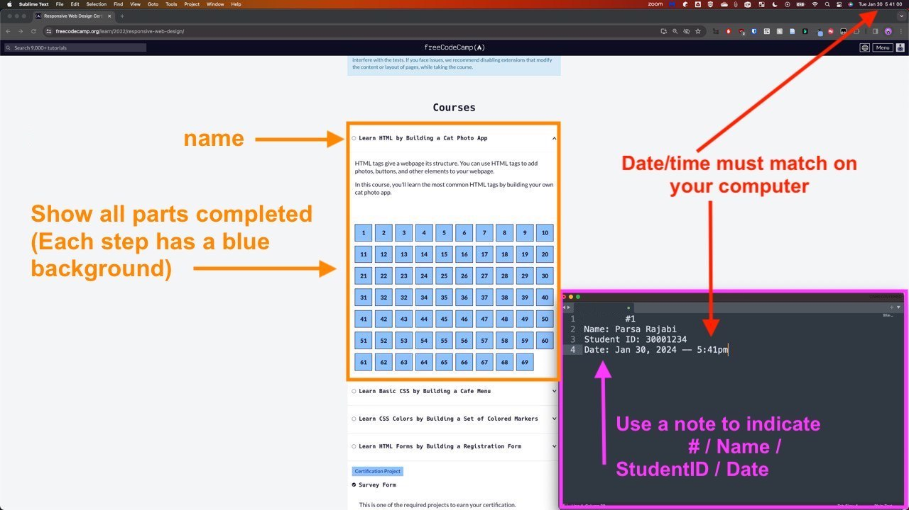
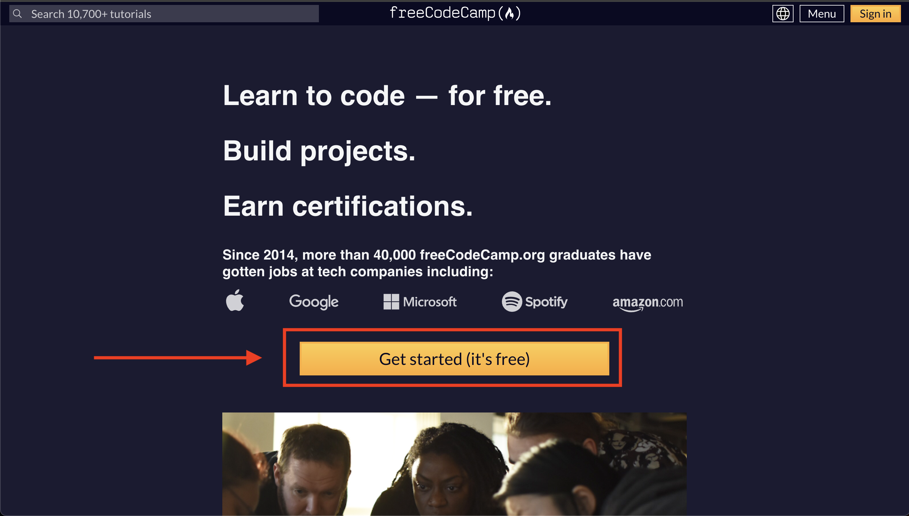
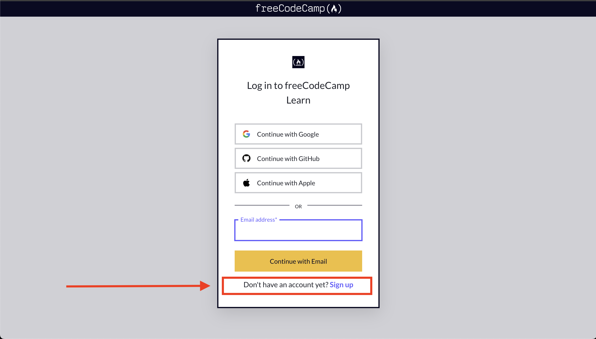
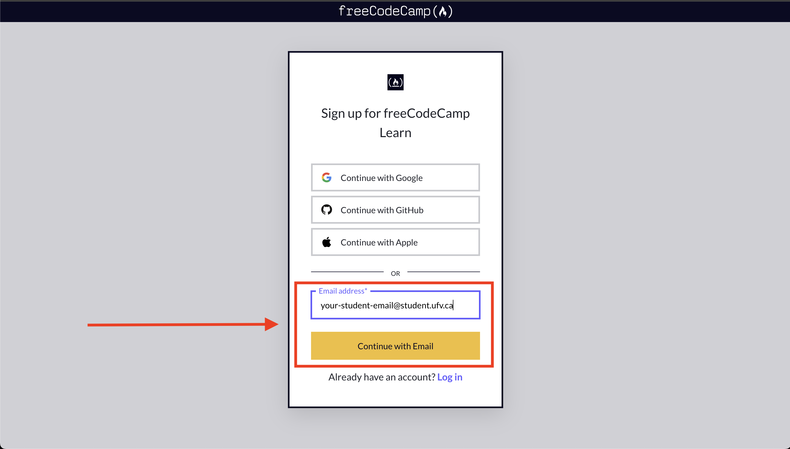
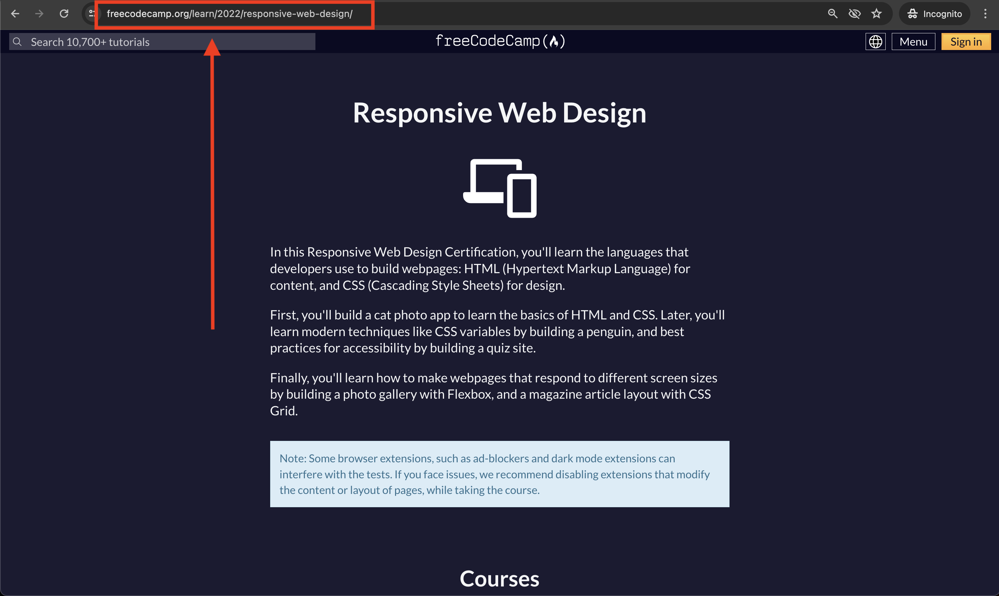

# Assignments

Course assignments are intended to be a practical application of the course material and a hands-on guide for your learning. We will be using **freeCodeCamp** as the platform to complete them. The freeCodeCamp curriculum is a series of challenges and assignments that you can complete to earn certifications in various programming languages and technologies

**IMPORTANT: Some topics will be covered in class and some will be self-taught.** Although most topics will be covered in class, the order of the assignments may not align with the course schedule. We will do our best to align the assignments with the course material, however, some assignments may require you to learn new topics on your own until the class covers the topic later in the term

## Submission Process

Below are submissions instructions for all assignments in this course:

1. Assignments should be completed via freeCodeCamp's website and a screenshot of all completed work should be submitted to Blackboard
2. The screenshot of completed work should include:
   1. **Your completed assignment:** Make sure ALL assigned components of the assignment are clearly visiable (you may take multiple screenshots if they do not fit) and have a checkmark or say "completed", indicating that they're completed.
   2. **A note/word file with your identification information:**
      1. Assignment Name
      2. Your Full Name
      3. Your Student ID
      4. Current Date/Time (this must match your system's date/time)

**Important:** Screenshot submissions without a note that includes the information above will recieve a 50% mark deduction. Failure to submit a screenshot to Blackboard will result in a mark of zero. No exceptions.

### Example Screenshot

Here is an example of how your screenshot(s) should look like. Make sure to include the all information required in the note and include the computer's date/time in the screenshot.

- **Not sure how to take a screen?**
  - Here's how to capture a screenshot:
    - [Windows](https://www.wikihow.com/Take-a-Screenshot-in-Microsoft-Windows)
    - [Mac](https://support.apple.com/en-ca/HT201361)

### Blackboard Submission

Here are the steps to submit your screenshot to Blackboard:

1. Go to myclasses/blackboard UFV
2. Navigate to CIS 145 Course
3. On the sidebar, select `Assignments`
4. Find the respective assignment
5. Submit your screenshot before the deadline

**Reminder:** All course elements (inlcuding but limited to) assignments, quizzes, weekly activities and exams are required to be submitted or completed by the specified due dates. Inability to adhere to these deadlines will lead to a score of zero, unless exceptional situations are considered on an individual basis, subject to the approval of the instructor and supported by legitimate documentation.

### Assignment Auditing

The instructor will audit the assignments to ensure that the work is original and completed by the student. The instructor will also verify that the assignment is completed according to the requirements. Students who submit work that is not their own will receive a mark of zero and will be reported to the academic integrity office. 

## Get Started - Create an Account

In order to get access to the assignments, you will need to create an account on freeCodeCamp's platform. Follow the instructions below to sign up:

- Go to [freeCodeCamp](https://www.freecodecamp.org/) and sign up for an account
  - You must use your stuednt `@student.ufv.ca` email account to sign up
- Once you have signed up, you can start working on the assignments by visiting the [Responsive Web Design page](https://www.freecodecamp.org/learn/2022/responsive-web-design/)

## Step by step instructions to sign up for freeCodeCamp:

### Step 1: Click on "Get Started"

### Step 2: Click "Don't have an account yet? Sign up"

### Step 3: Sign up with your `@student.ufv.ca` email, and click on "Continue with Email"

### Step 4: Navigate to the [Responsive Web Design web page](https://www.freecodecamp.org/learn/2022/responsive-web-design/)
