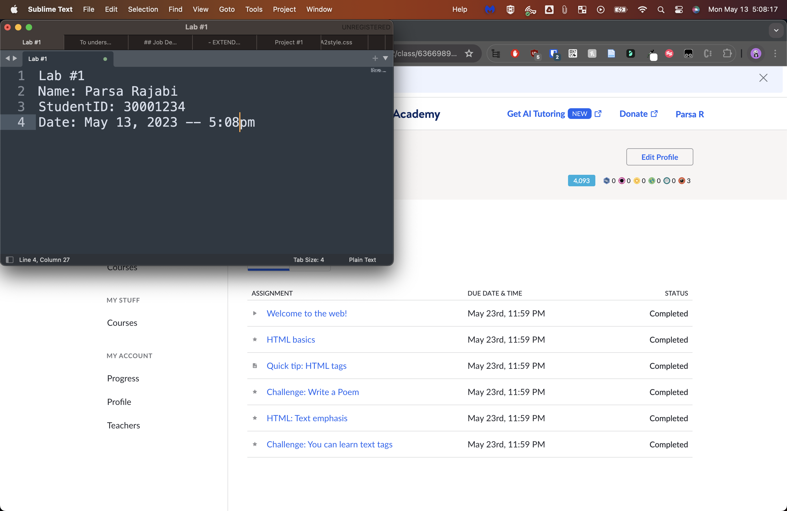
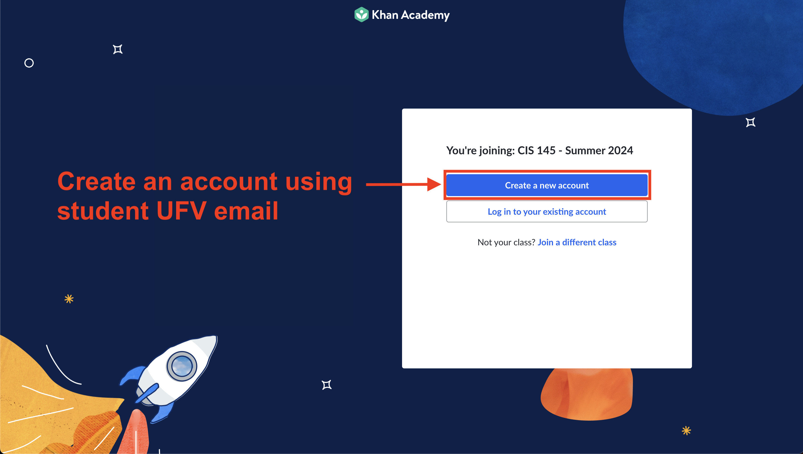
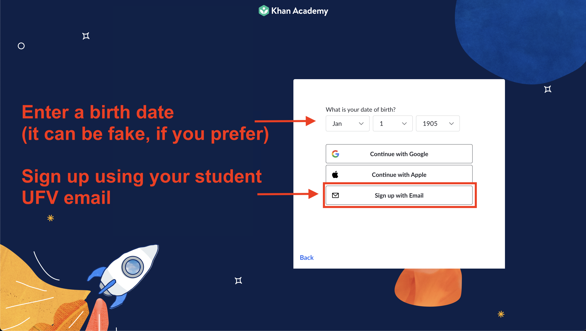
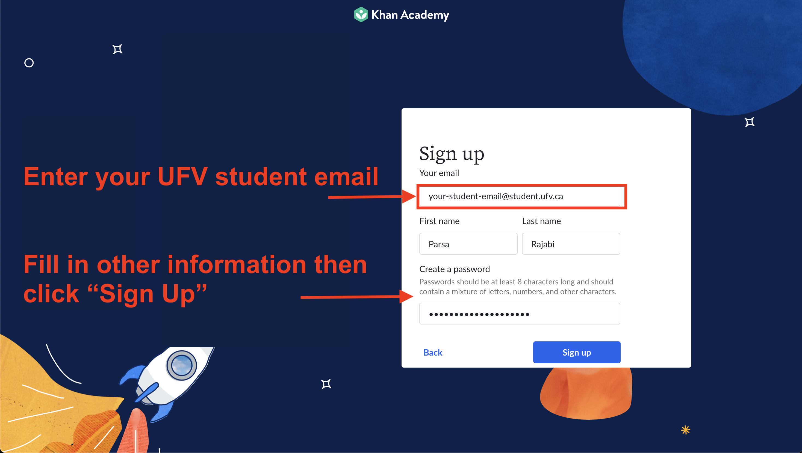

# Labs

Labs are intended as exercise for you to learn new concepts and get hands on experience to practice the course material. We will be using **Khan Academy** as the platform to complete them.

## Details 

Labs will be assigned via Kha Academy on a regular basis (~weekly). Check your email from Khan Academy for specific items that need to be completed. Some of these items include videos, readings, hands-on activities and knowledge checks. In order to recieve a "completion checkmark", videos need to be watched in full (from beginning to end), .

## Submission Process

Below are submissions instructions for all labs in this course:

1. Labs should be completed via Khan Academy's website and a screenshot of all completed work should be submitted to Blackboard
2. The screenshot of completed work should include:
   1. **Your completed lab:** Make sure ALL assigned components of the lab are clearly visiable (you may take multiple screenshots if they do not fit) and have a checkmark or say "completed", indicating that they're completed.
   2. **A note/word file with your identification information:**
      1. Lab #
      2. Your Full Name
      3. Your Student ID
      4. Current Date/Time (this must match your system's date/time)

**Important:** Screenshot submissions without a note that includes the information above will recieve a 50% mark deduction. Failure to submit a screenshot to Blackboard will result in a mark of zero. No exceptions.

### Example Screenshot

Here is an example of how your screenshot(s) should look like. Make sure to include the all information required in the note and include the computer's date/time in the screenshot.

- **Not sure how to take a screen?**
  - Here's how to capture a screenshot:
    - [Windows](https://www.wikihow.com/Take-a-Screenshot-in-Microsoft-Windows)
    - [Mac](https://support.apple.com/en-ca/HT201361)

### Blackboard Submission

Here are the steps to submit your screenshot to Blackboard:

1. Go to myclasses/blackboard UFV
2. Navigate to CIS 145 Course
3. On the sidebar, select `Labs`
4. Find the respective lab
5. Submit your screenshot before the deadline

**Reminder:** All course elements (inlcuding but limited to) assignments, quizzes, weekly activities and exams are required to be submitted or completed by the specified due dates. Inability to adhere to these deadlines will lead to a score of zero, unless exceptional situations are considered on an individual basis, subject to the approval of the instructor and supported by legitimate documentation.

## Get Started - Join Khan Academy

In order to get access to the labs, you will need to create an account on Khan Academy's platform. Follow the instructions below to sign up:

- Join the CIS 145 Khan Academy's classroom using [this link](https://www.khanacademy.org/join/9CAZFEXJ)
   - If you get prompted, enter `9CAZFEXJ` as the class code to join CIS 145 Summer 2024
   - **You must use your `@student.ufv.ca` email account to sign up**

## Step by step instructions to sign up for Khan Academy:

### Step 1: Click on "Create a new account"

### Step 2: Enter a date of birth (could be any date), and click on "Sign up with Email"

### Step 3: Sign up with your `@student.ufv.ca` email, and click on "Sign up"

