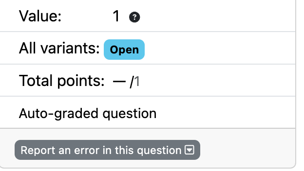
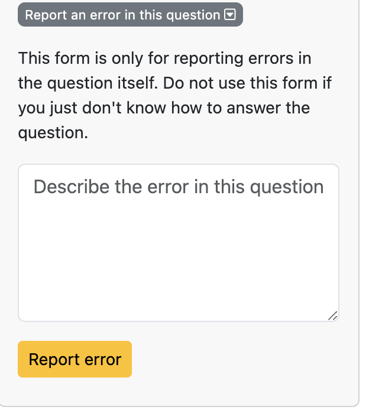
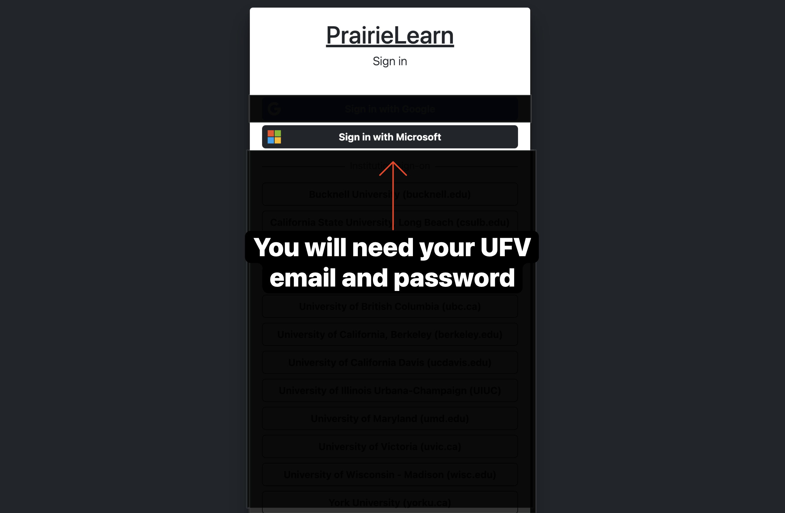
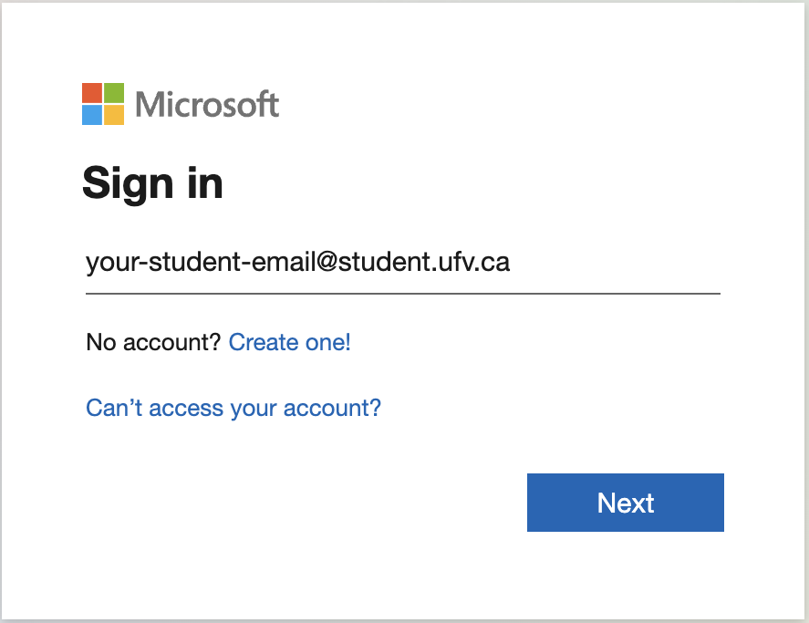
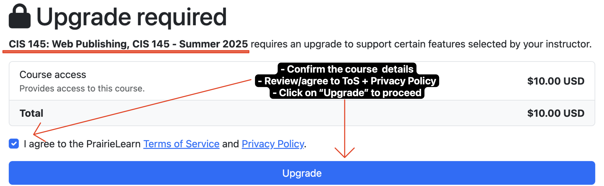
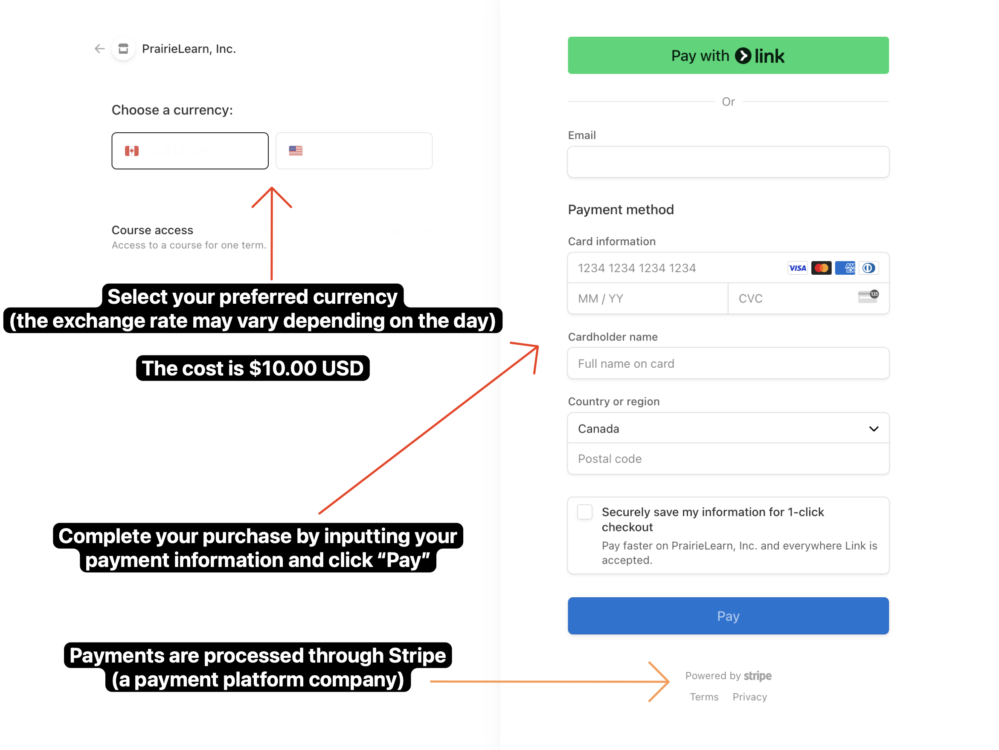

# Quizzes

Quizzes serve as a way to assess your understanding of the material covered in the course. They are designed to be completed after you have gone through the assigned readings and videos.

## Platform: PrairieLearn

Quizzes will be administered through **PrairieLearn**. You will need to purchase a PrairieLearn account to access the quizzes. The cost is $10.00 USD for the entire course (4 months).

## Quiz Dates 

- Quiz #0 (Syllabus): Tuesday, May 20, 2025 at 11:59 PM PST
  - This quiz is required to ensure you have read the syllabus and course policies. Grading will be based on completion, not correctness and will count towards your participation grade.
- Quiz #1: Monday, June 9, 2025
- Quiz #2: Monday, July 7, 2025

## Quiz 1 
- **What**: The quiz will cover all concepts from the first 4 weeks of the class (No CSS will be included in Quiz #1).
- **Date**: Monday, June 9, 2025
- **Time**: 8:30am - 11:20am PST
- **Where**: The quiz will be available on PrairieLearn. You can access it by logging into your PrairieLearn account via the link below:
  - [PrairieLearn - CIS 145](https://us.prairielearn.com/) - make sure to log in using the [instructions provided below](#get-started-with-prairielearn).
- **How**: The quiz will be a take-home, *open-book\** quiz. There will **NO zoom session** during the quiz. 
*note: refer to [quiz rules](#quiz-rules) to understand what open-book means
- Generally, your instructor will not be able to answer questions during the quiz - do your best with your best interpretation (and note them down in your answers, if needed).

> [!ATTENTION]
> Make sure you're in a place with a good computer and steady internet when taking the quiz. If your computer or internet stops working during the quiz, it is up to you to get back online and finish before the time's up. 

## Before the quiz:
- Update your computer so it doesn't start updating in the middle of your quiz.
- Try out your internet before and a few hours before the quiz. If you're using Wi-Fi, think about plugging into the internet with a cable.
- Make sure other devices aren't using up all the internet while you're on the quiz.

> [!ATTENTION]
> It's a good idea to have a backup plan, like another computer or different internet, just in case. You may also be able to use the computers located on campus (if you're nearby).

## Quiz Issues?

In case you run into any issues with PrairieLearn questions, use the "Report an error" button on the question page to report the issue. This includes any problems with the question itself, such as typos, incorrect answers, or unclear instructions.

## Quiz Rules
- You must complete the test BY YOURSELF (no friends, no tutors, no classmates, no humans - cats and dogs in the room are fine).
- Any form of communication with other humans, terrestrial or extraterrestrial is not allowed (Discord, Slack, WhatsApp, Terminal, Signal, iMessage, SMS, MMS, etc…)
- The test is open-book, open-notes, open-IDE (e.g. VSCode) EXCEPT websites and plugins that help you cheat such as ChatGPT, BingAI, Chegg, Course Hero, Slader and other similar websites that have tutors answering questions you upload 
> [!TIP]
> W3Schools, Khan Academy or freeCodeCamp are permissible as long as they are explicitly cited/references in your answers.
- Copying the question text and googling **IS CHEATING**
- Posting the question text and asking someone to solve it for you **IS CHEATING**
- Using google to search for concepts is NOT cheating (however using any AI-based search engine i.e. BingAI **IS CHEATING**).
- If you come across the same or similar question on google, resist the temptation to keep reading, and close your browser tab.
- Do NOT share quiz questions with anyone: that **IS CHEATING**
- Overall, do not stress! You will be fine.

## Get Started with PrairieLearn

Follow the instructions below to sign up/purchase PrairieLearn:

### Step 1: Create an account on PrairieLearn
- Open [PrairieLearn - CIS 145](https://us.prairielearn.com/pl/course_instance/182146) by clicking on the link or copying and pasting the following into your browser:
  - https://us.prairielearn.com/pl/course_instance/182146

### Step 2: Sign in using your student email
- Sign in with your student email (`@student.ufv.ca`) and password. 

### Step 3: Purchase a PrairieLearn account
- Review the course information and click on the "Upgrade" button to pay for your PrairieLearn account.
  - You will need to agree to the PrairieLearn Terms of Service and Privacy Policy. 

### Step 4: Complete the payment
- Enter your payment information and click on the "Pay" button to complete the purchase.

### Step 5: Success! Access the quizzes
- After completing the payment, you will be redirected to the PrairieLearn course page. You can now access the quizzes and other course materials. *Note: this may be blank at first, but will be populated as the course progresses.*

### Issues or Questions?

> [!WARNING]
> If you encounter any issues or have questions about PrairieLearn, please reach out to the course instructor or lab monitor via email for assistance. 