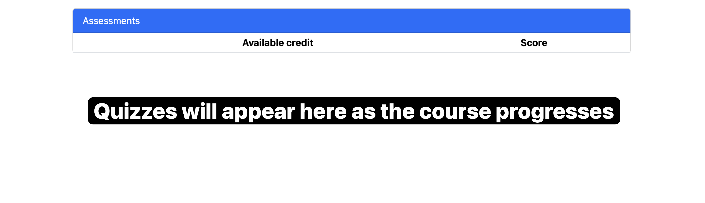

# Quizzes

Quizzes serve as a way to assess your understanding of the material covered in the course. They are designed to be completed after you have gone through the assigned readings and videos.

## Platform: PrairieLearn

Quizzes will be administered through **PrairieLearn**. You will need to purchase a PrairieLearn account to access the quizzes. The cost is $10.00 USD for the entire course (4 months).

## Quiz Dates 

- Quiz #0 (Syllabus): Tuesday, May 20, 2025 at 11:59 PM PST
  - This quiz is required to ensure you have read the syllabus and course policies. Grading will be based on completion, not correctness and will count towards your participation grade.
- Quiz #1: Monday, June 9, 2025
- Quiz #2: Monday, July 7, 2025

Quiz details will be provided closer to the quiz dates.

## Get Started with PrairieLearn

Follow the instructions below to sign up/purchase PrairieLearn:

### Step 1: Create an account on PrairieLearn
- Open [PrairieLearn - CIS 145](https://us.prairielearn.com/pl/course_instance/182146) by clicking on the link or copying and pasting the following into your browser:
  - https://us.prairielearn.com/pl/course_instance/182146

### Step 2: Sign in using your student email
- Sign in with your student email (`@student.ufv.ca`) and password. 

### Step 3: Purchase a PrairieLearn account
- Review the course information and click on the "Upgrade" button to pay for your PrairieLearn account.
  - You will need to agree to the PrairieLearn Terms of Service and Privacy Policy. 

### Step 4: Complete the payment
- Enter your payment information and click on the "Pay" button to complete the purchase.

### Step 5: Success! Access the quizzes
- After completing the payment, you will be redirected to the PrairieLearn course page. You can now access the quizzes and other course materials. *Note: this may be blank at first, but will be populated as the course progresses.*

### Issues or Questions?

> [!WARNING]
> If you encounter any issues or have questions about PrairieLearn, please reach out to the course instructor or lab monitor via email for assistance. 