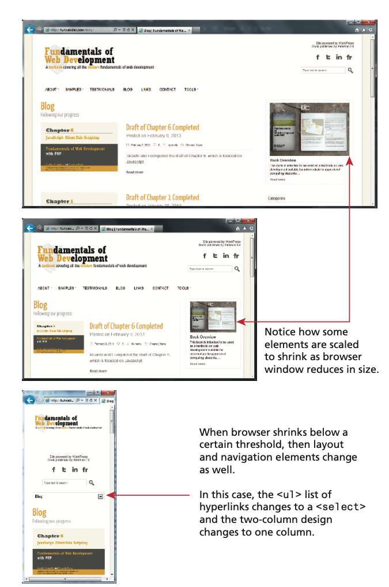

<!-- markdownlint-disable -->

# Responsive Web Design

As part of this week's lesson, we will understand the importance of responsive web design and how to create a responsive web page using HTML and CSS techniques.

## Table of Contents

<!-- toc -->
- [Responsive Web Design](#responsive-web-design)
  - [Table of Contents](#table-of-contents)
  - [Responsiveness of Web Pages](#responsiveness-of-web-pages)
  - [Page Layout](#page-layout)
  - [Fixed layout (solid layout or static layout)](#fixed-layout-solid-layout-or-static-layout)
  - [Fluid layout (liquid layout)](#fluid-layout-liquid-layout)
  - [Responsive Web Design](#responsive-web-design-1)

## Responsiveness of Web Pages

Responsive web design refers to enhancing a web page for different viewing contexts (such as smartphones and tablets) through the use of coding techniques including fluid layouts, flexible images, and media queries. Here is an example of a web page configured to display differently, depending on the viewport size detected by media queries.

In our previous lessons, you learned that complex multi-column layouts could be created with floats and/or positioning, but it was a bit of a hack in the sense that neither the `float` nor `position` property were designed to achieve that outcome.

To address this, W3C CSS introduced two new display properties:

- `flex`
- `grid`

Flexbox layout, which was implemented by all the major contemporary browsers by 2015, was designed for layout in one dimension (a row or a column). Grid layout, which was supported by the major browsers by mid-2017, was designed for layout in two dimensions. Because they are display properties, these two layout modes can be assigned to any element.

## Page Layout
- Wireframe is a sketch or diagram of a web page that shows the structure (but not the detailed design or content) of the basic page elements.
- Wireframes are used in the design process 
  - to experiment with various page layouts 
  - to develop site structure and navigation

A website is often divided into headers, menus, content, and a footer.
A Website Layout is usually one (or a combination) of the following:
1-column (often used for mobile browsers)
2-column (often used for tablets and laptops)
3-column layout (only used for desktops)
The following example shows one way to create a two column layout

## Fixed layout (solid layout or static layout)
It does not change with the size of the browser
Has fixed width and may hug left margin (unbalanced look)
Can be centered (more appealing)

## Fluid layout (liquid layout)
The content flows to fill whatever size the browser is
Content configured with percentage values for width
Can be centered

## Responsive Web Design

Responsive web design makes your web page look good on all devices.
Uses relative units and media queries, combining liquid and adaptive layout
As browser width increases/decreases, layout will flex (liquid layout)
If browser goes beyond certain width (from media query), then the layout changes to accommodate a wide or narrow width
