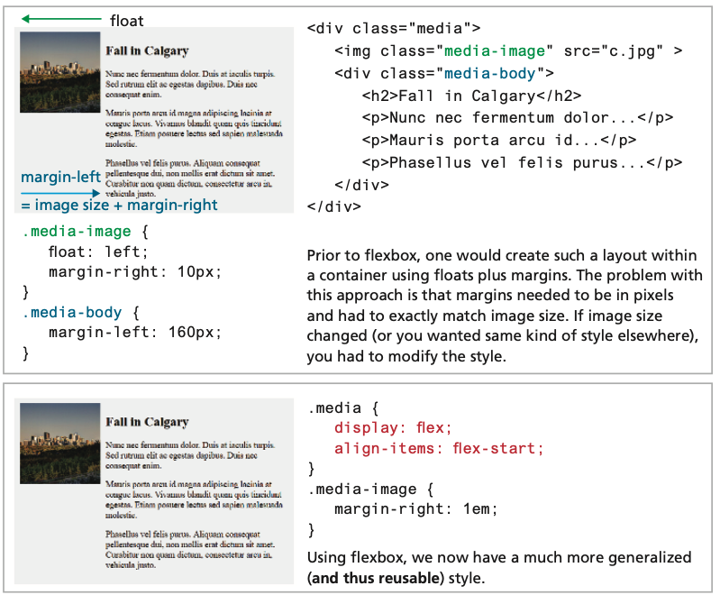
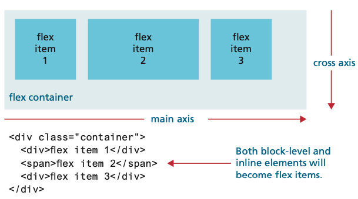
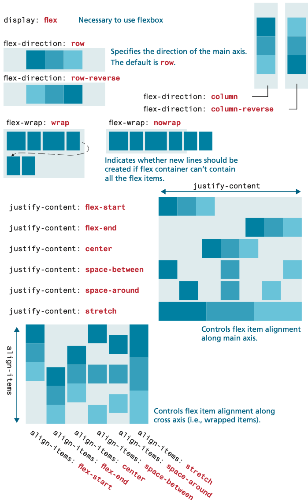
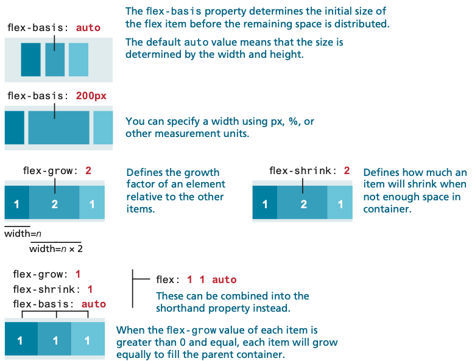
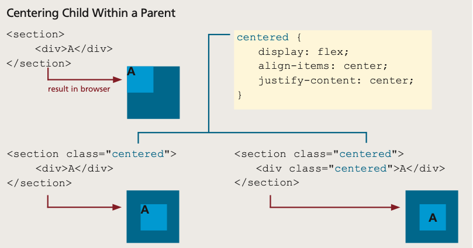
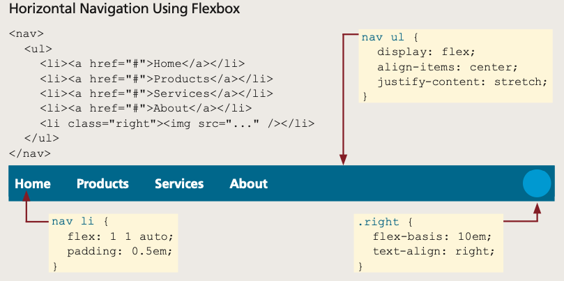
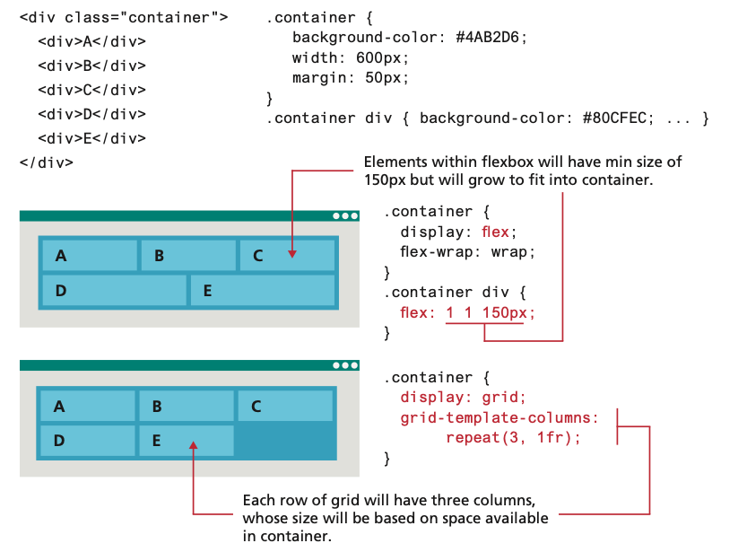

<!-- markdownlint-disable -->

# Responsive Web Design

As part of this week's lesson, we will understand the importance of responsive web design and how to create a responsive web page using HTML and CSS techniques.

## Table of Contents

<!-- toc -->
- [Responsive Web Design](#responsive-web-design)
  - [Table of Contents](#table-of-contents)
  - [Responsiveness of Web Pages](#responsiveness-of-web-pages)
  - [Flexbox Layout](#flexbox-layout)
    - [Flex Containers and Items](#flex-containers-and-items)
    - [Usecases for Flexbox](#usecases-for-flexbox)
  - [Grid Layout](#grid-layout)
  - [Page Layout](#page-layout)
  - [Fixed layout (solid layout or static layout)](#fixed-layout-solid-layout-or-static-layout)
  - [Fluid layout (liquid layout)](#fluid-layout-liquid-layout)
  - [Responsive Web Design](#responsive-web-design-1)

## Responsiveness of Web Pages

Responsive web design refers to enhancing a web page for different viewing contexts (such as smartphones and tablets) through the use of coding techniques including fluid layouts, flexible images, and media queries. Here is an example of a web page configured to display differently, depending on the viewport size detected by media queries.

In our previous lessons, you learned that complex multi-column layouts could be created with floats and/or positioning, but it was a bit of a hack in the sense that neither the `float` nor `position` property were designed to achieve that outcome.

To address this, W3C CSS introduced two new display properties:

- `flex`
- `grid`

Flexbox layout, which was implemented by all the major contemporary browsers by 2015, was designed for layout in one dimension (a row or a column). Grid layout, which was supported by the major browsers by mid-2017, was designed for layout in two dimensions. Because they are display properties, these two layout modes can be assigned to any element.

## Flexbox Layout

Flexbox layout is a CSS layout mode that provides a more efficient way to lay out, align, and distribute space among items in a container, even when their size is unknown and/or dynamic. The main idea behind the flex layout is to give the container the ability to alter its items' width/height (and order) to best fill the available space (mostly to accommodate all kinds of display devices and screen sizes).

This example illustrates how flexbox solves a very common design problem: placing two elements within two columns within a container.

The older approach using `floats` requires margin settings using pixels based on the size of the image. While this does work, it doesn’t scale very well. That is, what if we wanted the same display but with larger or smaller images? Flexbox provides a simpler way to construct a layout that is more maintainable and far less brittle (although flexboxes are not without their own quirks).

### Flex Containers and Items

The first step in learning flexbox is recognizing that there are two places in which you will be assigning flexbox properties: the flex `container` and the flex `items` within the container. 

This example illustrates how a flex container not surprisingly contains flex items:

Notice as well that the flex items are positioned in source order along a single main axis. So what would happen if we added a fourth item to this container? You can control this behavior via the `flex-wrap` property, but by default the new item would wrap to a new line in the direction of the cross axis.

As seen below, the **parent container** must have its `display` property set to `flex`. You can change the main axis from being a row to being a column, as well as the wrap behavior. This example also demonstrates the `align-items` and `justify-content` properties, that control how items are aligned within a container.

Individual flex items within the container also have their own flexbox properties; the most important of these are shown below:

### Usecases for Flexbox

Aligning an item horizontally and vertically within a container has always been a tricky problem with CSS; flexbox makes this process much easier. This example illustrates how to center a child within a parent container using flexbox. It also illustrates that flexbox works from the content out. That is, with flexbox, the content decides how much space it needs and its parent decides how to fit it based on space available on that line (or column):

Flexbox is often used to construct a horizontal navigation bar, since flex can distribute items evenly along a row. Similarly, flex is very helpful within data entry forms, especially for aligning labels, input controls, and buttons. The example below shows how one can simply construct an adaptable horizontal menu using flexbox:

## Grid Layout

While both flexbox and grid layout modes share some styling properties, it is important to understand how they differ:

## Page Layout
- Wireframe is a sketch or diagram of a web page that shows the structure (but not the detailed design or content) of the basic page elements.
- Wireframes are used in the design process 
  - to experiment with various page layouts 
  - to develop site structure and navigation

A website is often divided into headers, menus, content, and a footer.
A Website Layout is usually one (or a combination) of the following:
1-column (often used for mobile browsers)
2-column (often used for tablets and laptops)
3-column layout (only used for desktops)
The following example shows one way to create a two column layout

## Fixed layout (solid layout or static layout)
It does not change with the size of the browser
Has fixed width and may hug left margin (unbalanced look)
Can be centered (more appealing)

## Fluid layout (liquid layout)
The content flows to fill whatever size the browser is
Content configured with percentage values for width
Can be centered

## Responsive Web Design

Responsive web design makes your web page look good on all devices.
Uses relative units and media queries, combining liquid and adaptive layout
As browser width increases/decreases, layout will flex (liquid layout)
If browser goes beyond certain width (from media query), then the layout changes to accommodate a wide or narrow width
