<!-- markdownlint-disable -->
# HTML Forms

As part of this lesson, we'll continue our lesson on CSS and discuss advance ways to apply CSS to our web pages.
## Table of Contents

- [CSS Basics 2](#css-basics-2)
  - [Table of Contents](#table-of-contents)
  - [CSS Selectors](#css-selectors)
    - [Element selectors](#element-selectors)
    - [Decendant Selector](#decendant-selector)
    - [Class Selector](#class-selector)
    - [ID Selector](#id-selector)
    - [Class \& ID in Action](#class--id-in-action)
  - [Cascade in CSS](#cascade-in-css)
    - [Inheritance](#inheritance)
    - [Specificity](#specificity)
    - [Location](#location)


The videos below provide an overview of the topics for this week. You can watch the videos before or after reading the content for this week.

<!-- Inline CSS -->
<!-- <iframe width="560" height="315" src="https://www.youtube.com/embed/TZTaGTQKl2I?si=hpIpHAJxFQg1kLBz" title="YouTube video player" frameborder="0" allow="accelerometer; autoplay; clipboard-write; encrypted-media; gyroscope; picture-in-picture; web-share" referrerpolicy="strict-origin-when-cross-origin" allowfullscreen></iframe> -->

<!-- All 3 ways of adding CSS -->
<!-- <iframe width="560" height="315" src="https://www.youtube.com/embed/WF8Ai6-JsNI?si=fz5Dsu_tivSYTFM-" title="YouTube video player" frameborder="0" allow="accelerometer; autoplay; clipboard-write; encrypted-media; gyroscope; picture-in-picture; web-share" referrerpolicy="strict-origin-when-cross-origin" allowfullscreen></iframe> -->

<!-- External CSS -->
<!-- <iframe width="560" height="315" src="https://www.youtube.com/embed/4OMdzHnys9o?si=p4uqupI0eRTqK2-K" title="YouTube video player" frameborder="0" allow="accelerometer; autoplay; clipboard-write; encrypted-media; gyroscope; picture-in-picture; web-share" referrerpolicy="strict-origin-when-cross-origin" allowfullscreen></iframe> -->

<!-- CSS Validation -->
<!-- <iframe width="560" height="315" src="https://www.youtube.com/embed/5tzE2Je3Y10?si=4rpndp3NUMJezgNf" title="YouTube video player" frameborder="0" allow="accelerometer; autoplay; clipboard-write; encrypted-media; gyroscope; picture-in-picture; web-share" referrerpolicy="strict-origin-when-cross-origin" allowfullscreen></iframe> -->

## Forms
- Forms provide the user with an alternative way to interact with a web server.
- Up to now, clicking hyperlinks was the only mechanism available to the user
- Using a form, the user can enter text, choose items from lists, and click buttons
- Typically, programs running on the server will take the input from HTML forms and do something with it, 
  - such as save it in a database, 
  - interact with an external web service, or 
  - customize subsequent HTML based on that input.
- HTML5 has added a number of new controls and more customization options


<!-- 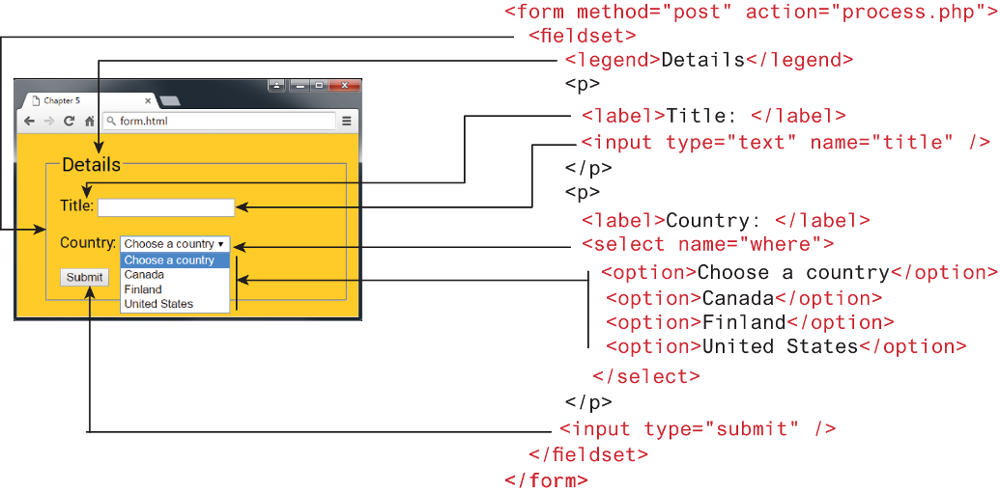 -->

# How Forms Work

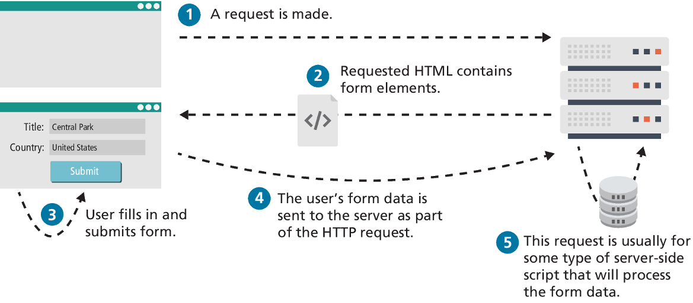


## Form Structure


- Two important attributes that are essential features of any <form> are the action and the  method attributes.
- The action attribute specifies the URL of the server-side resource that will process the form data.
- The method attribute specifies how the query string data will be transmitted from the browser to the server. There are two possibilities: 
  - GET  
  - POST


### method="GET"

- Data can be clearly seen in the address bar. This may be an advantage during development but a disadvantage in production. 
- Data remains in browser history and cache. Again this may be beneficial to some users, but it is a security risk on public computers.
- Data can be bookmarked (also an advantage and a disadvantage).
- There is a limit on the number of characters in the returned form data.


### method="POST"

- Data can contain binary data.
- Data is hidden from user.
- Submitted data is not stored in cache, history, or bookmarks.

> [!NOTE]
> It should be noted that while the POST method “hides” form data, any user could easily inspect the HTTP header. As a result, the POST method is NOT sufficient from a security standpoint.

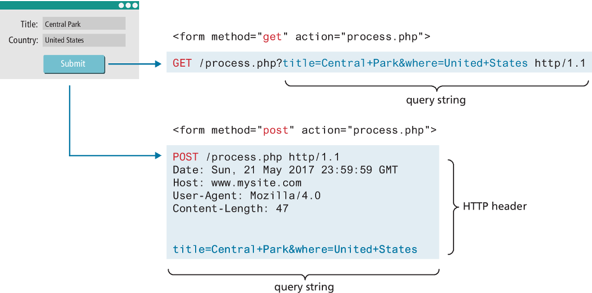

## Query Strings

- The browser “sends” the data to the server via an HTTP request using a query string. 
- A query string is a series of name=value pairs separated by ampersands (the & character). Special symbols must be URL encoded

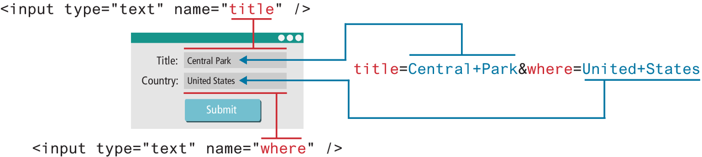


## Form Control Elements

- `<button>` Defines a clickable button.
- `<datalist>` An HTML5 element that defines lists of pre-defined values to use with input fields.
- `<fieldset>` Groups related elements in a form together.
- `<form>` Defines the form container.
- `<input>` Defines an input field. HTML5 defines over 20 different types of input.
- `<label>` Defines a label for a form input element.
- `<legend>` Defines the label for a fieldset group.
- `<optgroup>` Defines a group of related options in a multi-item list.
- `<option>` Defines an option in a multi-item list.
- `<output>` Defines the result of a calculation.
- `<select>` Defines a multi-item list.
- `<textarea>` Defines a multiline text entry box.

## Text Input Controls

- Most forms need to gather text information from the user. Whether it is a search box or a login form or a user registration form, some type of text input is usually necessary.

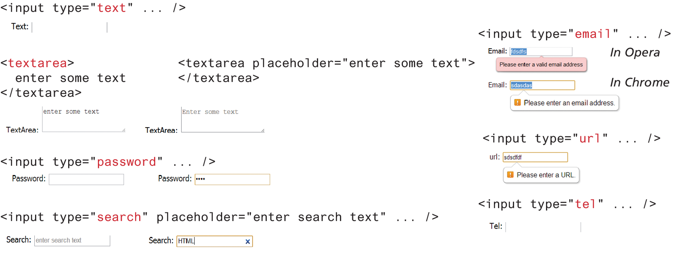


## Choice Controls

- Forms often need the user to select an option from a group of choices. HTML provides several ways to do this.
  - Select Lists
  - Radio Buttons
  - Checkboxes


### Select Lists

- The `<select>` element is used to create a multiline box for selecting one or more items. The options (defined using the `<option>` element) can be hidden in a dropdown list or multiple rows of the list can be visible.
- The selected attribute in the `<option>` makes it a default value.
- The value attribute is optional; if it is not specified, then the text within the container is sent instead

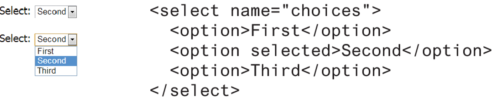

- Option items can be grouped together via the `<optgroup>` element. 


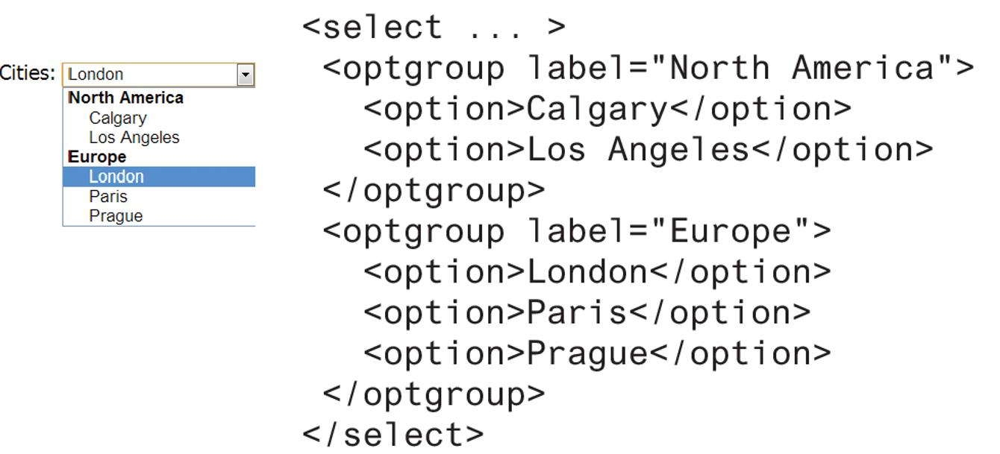

### Radio Buttons

- Radio buttons are useful when you want the user to select a single item from a small list of choices and you want all the choices to be visible.
- radio buttons are added via the `<input type="radio">` element
- The checked attribute is used to indicate the default choice, while the value attribute works in the same manner as with the `<option>` element.

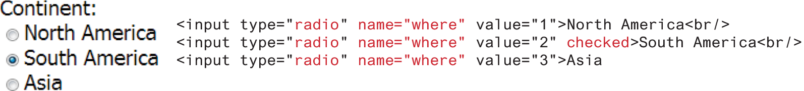

### Checkboxes

- A checkbox is used for obtaining a yes/no or on/off response from the user.
- Checkboxes are added via the `<input type="checkbox">`
- The checked attribute can be used to set the default value of a checkbox.
- Each checked checkbox will have its value sent to the server.

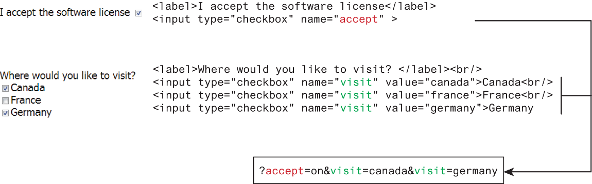


## Button Controls

- `<input type="submit">` Creates a button that submits the form data to the server.
- `<input type="reset">` Creates a button that clears any of the user’s already entered form data.
- `<input type="button">` Creates a custom button. This button may require JavaScript for it to actually perform any action.
- `<input type="image">` Creates a custom submit button that uses an image for its display.
- `<button>` Creates a custom button.

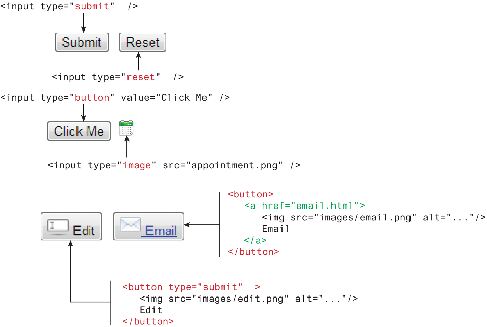

## Range Input

- HTML5 introduced the number and range controls provide a way to input numeric values that eliminates the need for client-side numeric validation 

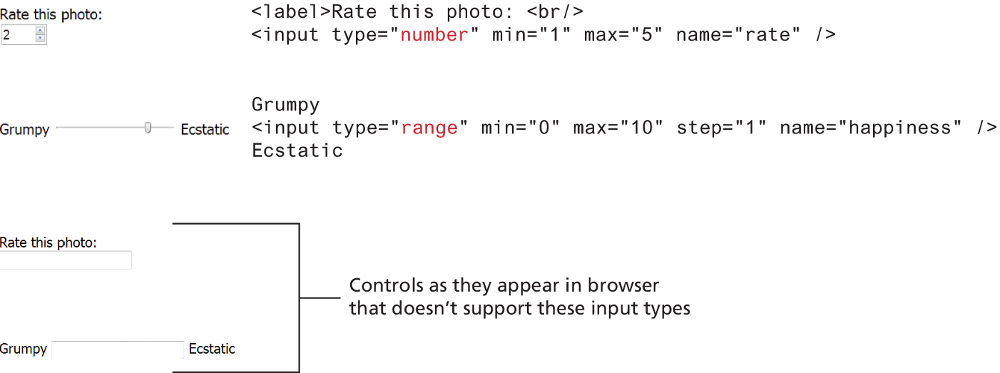

## Colour Input

When it is necessary, the HTML5 color control provides a convenient interface for the user

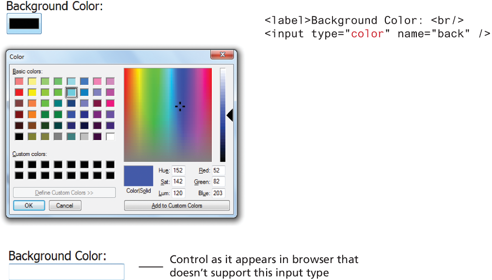

## Date & Time

```html
<input type="..." />
```

Input type:
- `date` Creates a general date input control. The format for the date is “yyyy-mm-dd.”
- `time` Creates a time input control. The format for the time is “HH:MM:SS,” for hours:minutes:seconds.
- `datetime` Creates a control in which the user can enter a date and time.
- `datetime-local` Creates a control in which the user can enter a date and time without specifying a time zone.
- `month` Creates a control in which the user can enter a month in a year. The format is “yyyy-mm.” 
- `week` Creates a control in which the user can specify a week in a year. The format is “yyyy-W##.”

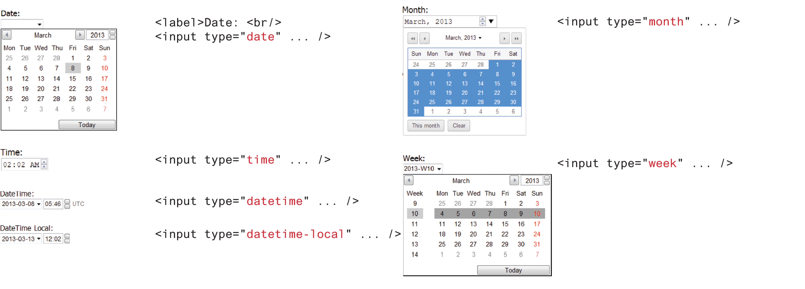

## Form Accessibility

- We already made use of the `<fieldset>`, `<legend>`, and `<label>` elements.
  - Their main purpose is to logically group related form input elements together with the `<legend>` providing a type of caption for those elements.
- Each `<label>` element should be associated with a single input element.
- You can make this association explicit by using the for attribute so means that if the user clicks on or taps the `<label>` text the control will receive the focus

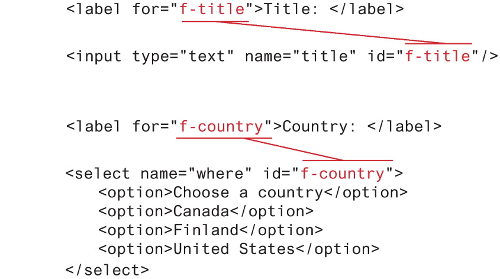

## Styling Forms

- Let’s begin with the common text and button controls. A common styling change is to eliminate the borders and add in rounded corners and padding.

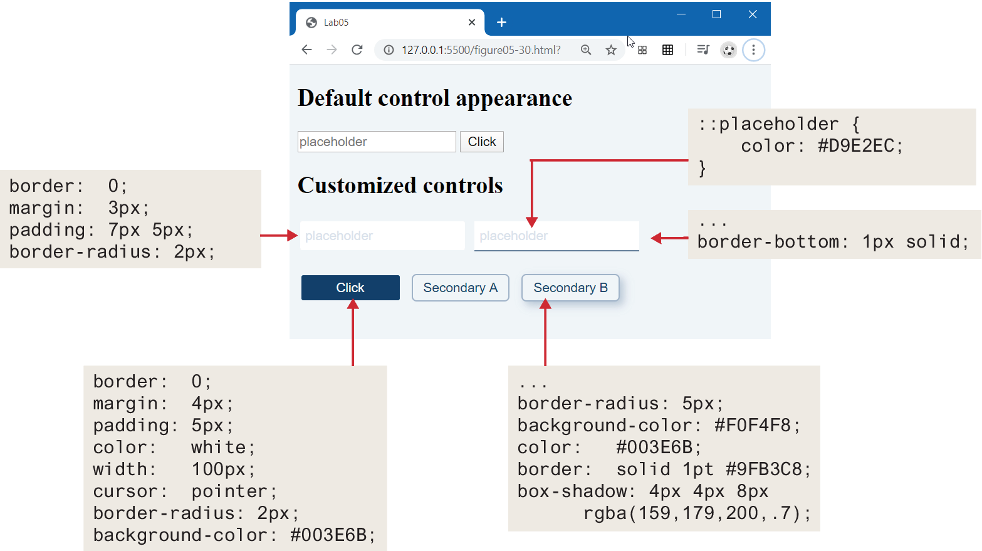


### Working with Labels

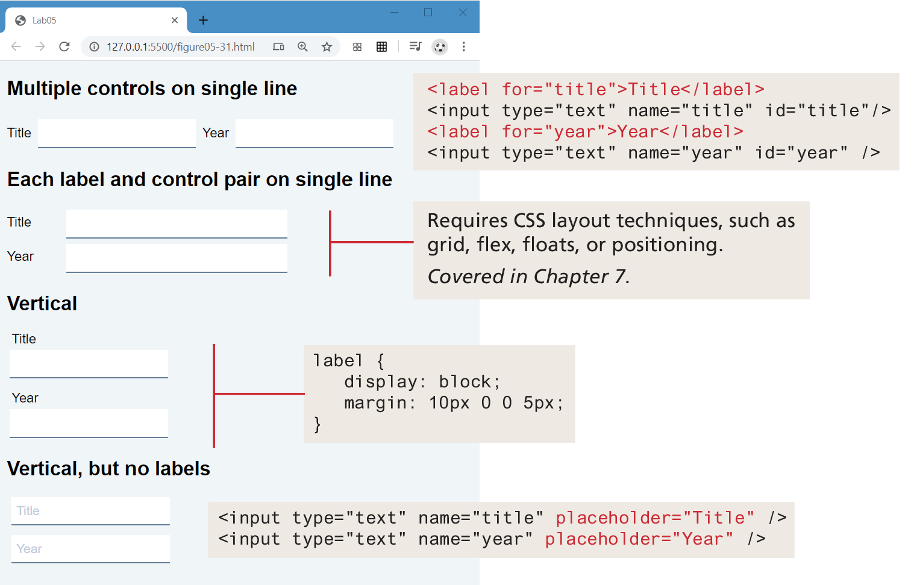


### Form Design

- A well-designed form communicates to a user that the site values their time and data.
- Perhaps the first and most important rule is to style your form elements so they look different from the default settings.
- Figure 5.33 describes and illustrates a small set of straightforward additional precepts

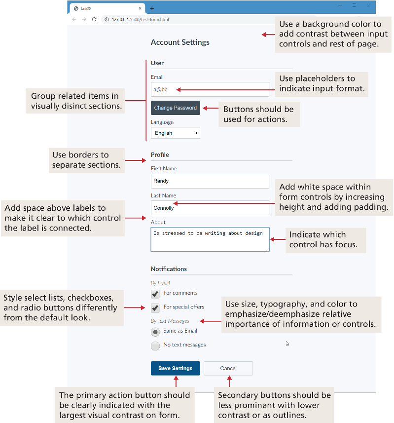


## Validating User Input

- User input must never be trusted. 
- It could be missing. 
- It might be in the wrong format.
- It might even contain JavaScript or SQL as a means to causing some type of havoc. 
- Thus, almost always user input must be tested for validity.

### Types of Validation

- **Required information**: Some data fields just cannot be left empty.
- **Correct data type**: Some fields such as numbers or dates, must follow the rules for its data type in order to be considered valid.
- **Correct format**: Some information, such as postal codes, credit card numbers, and social security numbers have to follow certain pattern rules.
- **Comparison**: Some user-entered fields are considered correct or not in relation to an already inputted value (password confirm)
- **Range check**
- **Custom**

### Notifying the User

- What is the problem? Users do not want to read lengthy messages to determine what needs to be changed.
- Where is the problem? Some type of error indication should be located near the field that generated the problem.
- If appropriate, how do I fix it? For instance, don’t just tell the user that a date is in the wrong format; tell him or her what format you are expecting

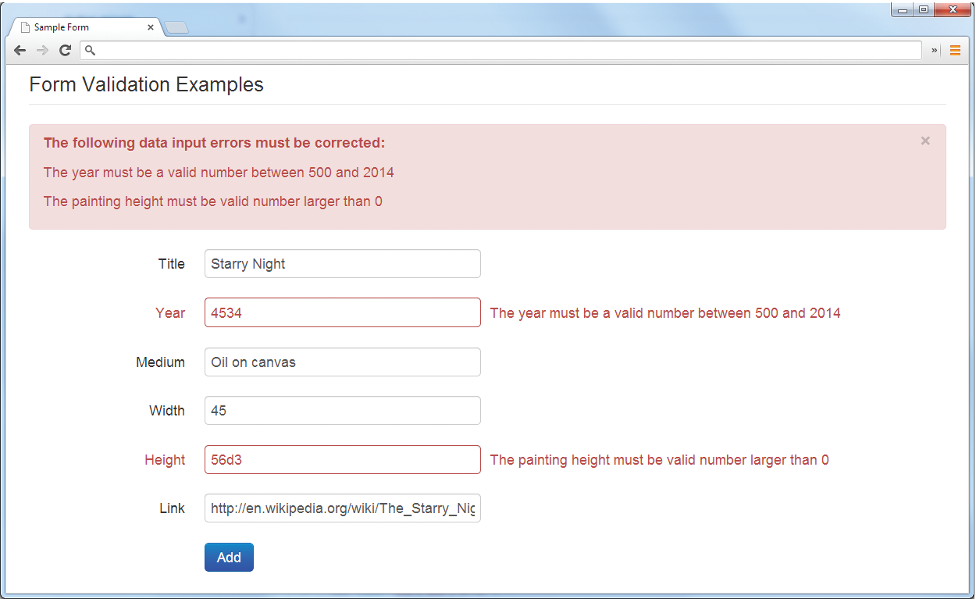

### How to Reduce Validation Errors

- Provide textual hints to the user on the form itself (last slide)
- Using tool tips or pop-overs to display context-sensitive help about the expected input
- Another technique for helping the user understand the correct format for an input field is to provide a JavaScript-based mask
- Providing sensible default values for text fields can reduce validation errors
- Finally, many user input errors can be eliminated by choosing a better data entry type than the standard `<input type="text">`

### Where to Conduct Validation

- Validation can be performed at three different levels.
  - With HTML5, the browser can perform **basic validation**.
  - **JavaScript validation** dramatically improves the user experience of data-entry forms, and is an essential feature of any real-world web site that uses forms. Unfortunately, JavaScript validation cannot be relied on.
  - **server-side validation** is arguably the most important since it is the only validation that is guaranteed to run.


