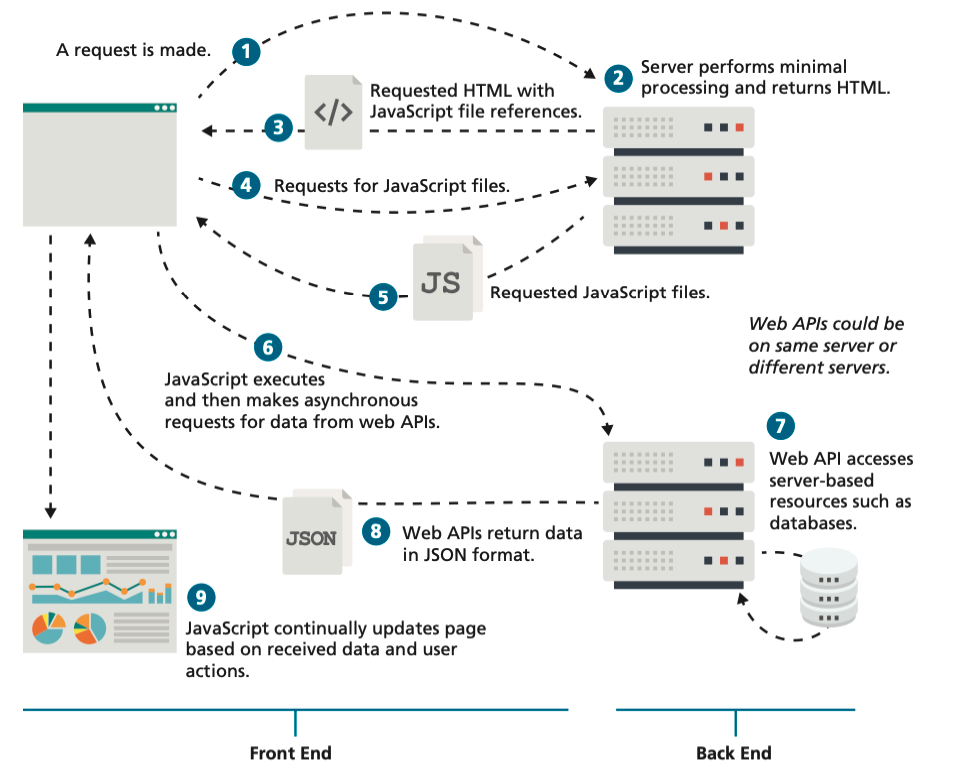
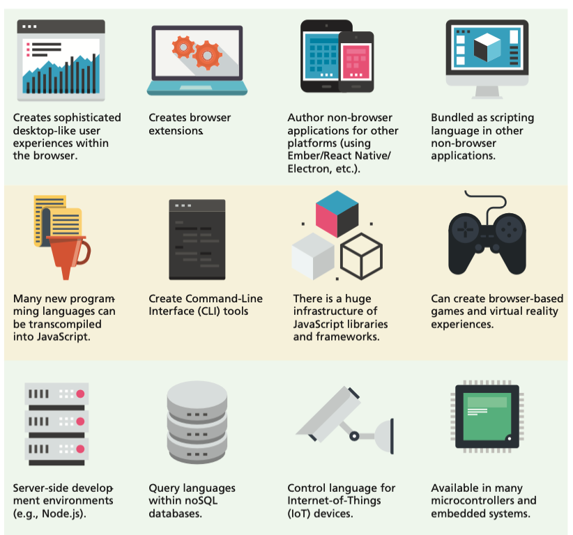

<!-- markdownlint-disable -->
# Intro to JavaScript + jQuery

As part of this lesson, we'll cover the baiscs of JavaScript and jQuery. JavaScript is a programming language that is used to create interactive effects within web browsers. jQuery is a JavaScript library that simplifies the process of writing JavaScript code.

## Table of Contents

- [Intro to JavaScript + jQuery](#intro-to-javascript--jquery)
  - [Table of Contents](#table-of-contents)
  - [JavaScript](#javascript)
  - [Client-Side Scripting](#client-side-scripting)
  - [Where Does JavaScript Fit In?](#where-does-javascript-fit-in)
    - [Inline JavaScript](#inline-javascript)
    - [Embedded JavaScript](#embedded-javascript)
    - [External JavaScript](#external-javascript)
  - 

The videos below provide an overview of the topics for this week. You can watch the videos before or after reading the content for this week.

## JavaScript

JavaScript is a programming language that is used to create interactive effects within web browsers. JavaScript is is an object-oriented, dynamically typed scripting language. In the context of this course, we will be primarily using JavaScript as a client-side language (although it can also be used on the server-side with Node.js).

## Client-Side Scripting

The idea of client-side scripting is an important one in web development. It refers to the client machine (i.e., the browser) running code locally rather than relying on the server to execute code and return the result. There are many client-side languages that have come into use over the past two decades including Flash, VBScript, Java, and JavaScript. Some of these technologies only work in certain browsers, while others require plugins to function (although the majority of them have been deprecated in favor of JavaScript). We will focus on JavaScript due to its browser interoperability (that is, its ability to work/operate on most browsers). The figures below shows how a client machine downloads and executes JavaScript code:

While JavaScript is still predominately used to create user interfaces in browser-based applications, its role has expanded beyond the constraints of the browser, as seen in the figure below.

Thanks in part to Google, Mozilla, and Microsoft, SpiderMonkey, and Chakra (their respective JavaScript engines) as open-source projects that can be embedded into any C++ application, JavaScript has migrated into other non-browser applications. It can be used as the language within server-side runtime environments such as Node.js. Some newer non-relational database systems such as MongoDB use JavaScript as their query language. Complex desktop applications such as Adobe Creative Suite and OpenOffice use JavaScript as their end-user script- ing language. A wide variety of hardware devices such as the Oculus Rift headset and the Arduino and Raspberry Pi microcontrollers make use of an embedded JavaScript engine. Indeed, JavaScript appears poised to be the main language for the emerging Internet of Things.

## Where Does JavaScript Fit In?

Just as CSS styles can be inline, embedded, or external, JavaScript can be included in a number of ways. Just as with CSS, these can be combined, but external is the preferred method for simplifying the markup page and ease of maintenance. The example below illustrates the three different ways JavaScript can be added to an HTML page. Notice that JavaScript can appear in both the `<head>` and the `<body>` elements.

### Inline JavaScript

Inline Javascript refers to the practice of including JavaScript code directly within some HTML element attributes, as can be seen above. You may recall that earlier in the course, you were warned that inline CSS is in general a **bad practice** and should be avoided. The **same is true with JavaScript**. In fact, inline JavaScript is much worse than inline CSS, as maintaining inline JavaScript is a real night-mare, requiring maintainers to scan through almost every line of HTML looking for your inline JavaScript. W3C and standard best practices strongly discourage you from using inline JavaScript.

### Embedded JavaScript

Embedded JavaScript refers to the practice of placing JavaScript code within a `<script>` element, as shown above. Like its equivalent in CSS, embedded JavaScript is okay for quick testing and for learning scenarios (e.g., small samples in this book) but is
usually avoided. As with inline JavaScript, embedded scripts can be difficult to maintain.

### External JavaScript

The recommended way to use JavaScript is to place it in an external file. You do this via the `<script>` tag as shown above. By convention, JavaScript external files have the file extension `.js`. Modern websites often have links to several, maybe even dozens, of external JavaScript files (also called libraries). These external files typically contain function definitions, data definitions, and other blocks of JavaScript code.

In the example above, the links to the external JavaScript file appear both in the `<head>` and in the `<body>` elements. Generally speaking, for maintainability reasons, `<script>` elements are usually placed within the `<head>` element (and for performance reasons, after any CSS `<link>` elements). For performance reasons, some scripts are placed at the end of the document, just before the `</body>` closing tag.
Some of the initial examples in this section place the `<script>` tag right before the `</body>` tag for a different reason. Those examples are performing DOM manipulation, which can only occur after the body/document is completely read in. However, once event handling is covered, the `<script>` tag will move back to the `<head>`.

## 