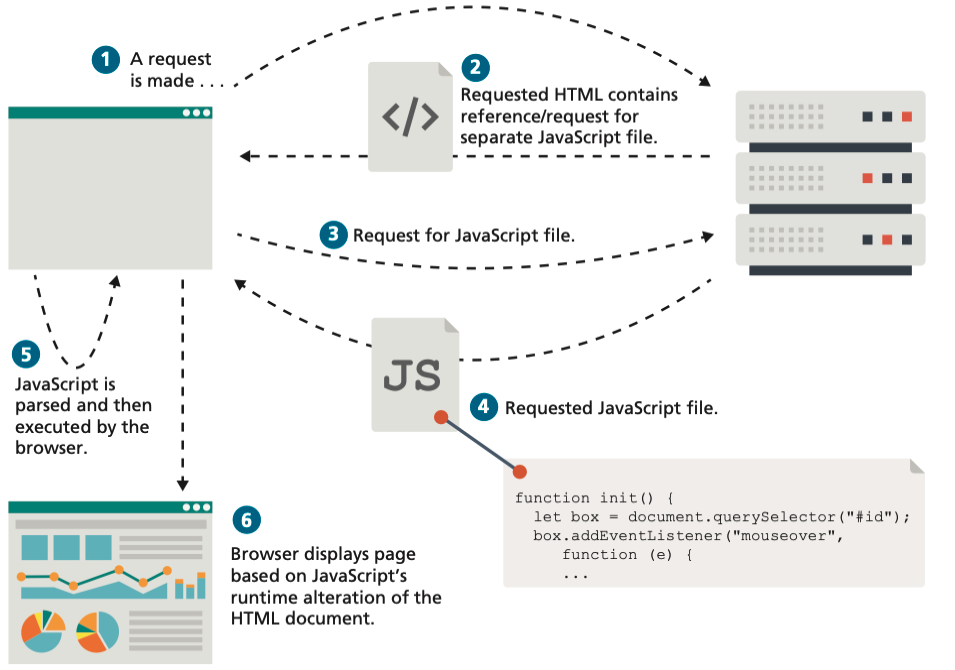
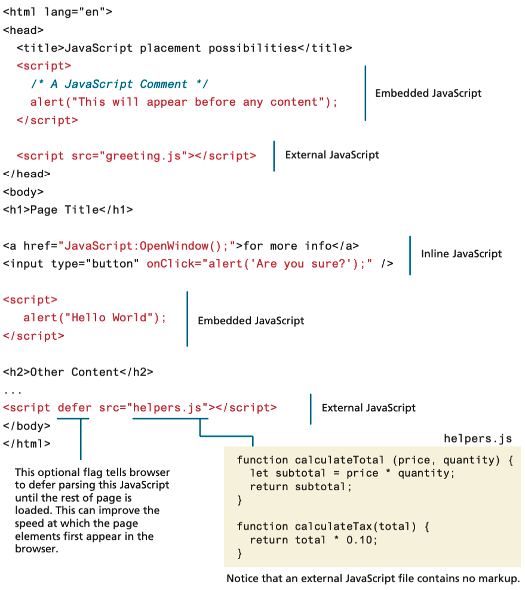
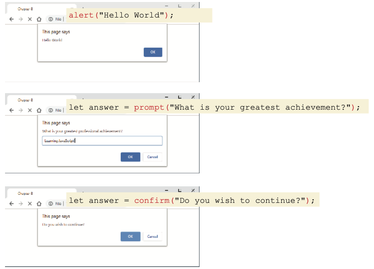
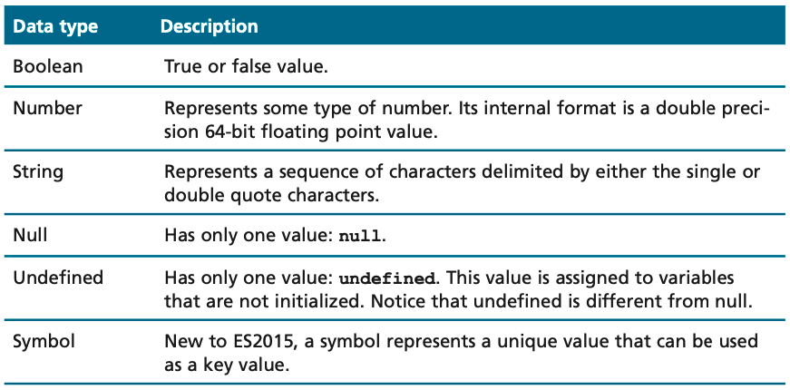

<!-- markdownlint-disable -->
# Intro to JavaScript + jQuery

As part of this lesson, we'll cover the baiscs of JavaScript and jQuery. JavaScript is a programming language that is used to create interactive effects within web browsers. jQuery is a JavaScript library that simplifies the process of writing JavaScript code.

## Table of Contents

- [Intro to JavaScript + jQuery](#intro-to-javascript--jquery)
  - [Table of Contents](#table-of-contents)
  - [JavaScript](#javascript)
  - [Client-Side Scripting](#client-side-scripting)
  - [Where Does JavaScript Fit In?](#where-does-javascript-fit-in)
    - [Inline JavaScript](#inline-javascript)
    - [Embedded JavaScript](#embedded-javascript)
    - [External JavaScript](#external-javascript)
  - [JavaScript Basics](#javascript-basics)
    - [Variables](#variables)
  - [JavaScript Output](#javascript-output)
  - [Data Types](#data-types)
  - [Concatenation](#concatenation)


The videos below provide an overview of the topics for this week. You can watch the videos before or after reading the content for this week.


## JavaScript

JavaScript is a programming language that is used to create interactive effects within web browsers. JavaScript is is an object-oriented, dynamically typed scripting language. In the context of this course, we will be primarily using JavaScript as a client-side language (although it can also be used on the server-side with Node.js).

## Client-Side Scripting

The idea of client-side scripting is an important one in web development. It refers to the client machine (i.e., the browser) running code locally rather than relying on the server to execute code and return the result. There are many client-side languages that have come into use over the past two decades including Flash, VBScript, Java, and JavaScript. Some of these technologies only work in certain browsers, while others require plugins to function (although the majority of them have been deprecated in favor of JavaScript). We will focus on JavaScript due to its browser interoperability (that is, its ability to work/operate on most browsers). The figures below shows how a client machine downloads and executes JavaScript code:




While JavaScript is still predominately used to create user interfaces in browser-based applications, its role has expanded beyond the constraints of the browser, as seen in the figure below.

Thanks in part to Google, Mozilla, and Microsoft, SpiderMonkey, and Chakra (their respective JavaScript engines) as open-source projects that can be embedded into any C++ application, JavaScript has migrated into other non-browser applications. It can be used as the language within server-side runtime environments such as Node.js. Some newer non-relational database systems such as MongoDB use JavaScript as their query language. Complex desktop applications such as Adobe Creative Suite and OpenOffice use JavaScript as their end-user script- ing language. A wide variety of hardware devices such as the Oculus Rift headset and the Arduino and Raspberry Pi microcontrollers make use of an embedded JavaScript engine. Indeed, JavaScript appears poised to be the main language for the emerging Internet of Things.


## Where Does JavaScript Fit In?

Just as CSS styles can be inline, embedded, or external, JavaScript can be included in a number of ways. Just as with CSS, these can be combined, but external is the preferred method for simplifying the markup page and ease of maintenance. The example below illustrates the three different ways JavaScript can be added to an HTML page. Notice that JavaScript can appear in both the `<head>` and the `<body>` elements.



### Inline JavaScript

Inline Javascript refers to the practice of including JavaScript code directly within some HTML element attributes, as can be seen above. You may recall that earlier in the course, you were warned that inline CSS is in general a **bad practice** and should be avoided. The **same is true with JavaScript**. In fact, inline JavaScript is much worse than inline CSS, as maintaining inline JavaScript is a real night-mare, requiring maintainers to scan through almost every line of HTML looking for your inline JavaScript. W3C and standard best practices strongly discourage you from using inline JavaScript.

### Embedded JavaScript

Embedded JavaScript refers to the practice of placing JavaScript code within a `<script>` element, as shown above. Like its equivalent in CSS, embedded JavaScript is okay for quick testing and for learning scenarios (e.g., small samples in this book) but is
usually avoided. As with inline JavaScript, embedded scripts can be difficult to maintain.

### External JavaScript

The recommended way to use JavaScript is to place it in an external file. You do this via the `<script>` tag as shown above. By convention, JavaScript external files have the file extension `.js`. Modern websites often have links to several, maybe even dozens, of external JavaScript files (also called libraries). These external files typically contain function definitions, data definitions, and other blocks of JavaScript code.

In the example above, the links to the external JavaScript file appear both in the `<head>` and in the `<body>` elements. Generally speaking, for maintainability reasons, `<script>` elements are usually placed within the `<head>` element (and for performance reasons, after any CSS `<link>` elements). For performance reasons, some scripts are placed at the end of the document, just before the `</body>` closing tag.
Some of the initial examples in this section place the `<script>` tag right before the `</body>` tag for a different reason. Those examples are performing DOM manipulation, which can only occur after the body/document is completely read in. However, once event handling is covered, the `<script>` tag will move back to the `<head>`.

## JavaScript Basics

### Variables

When one learns a new programming language, it is conventional to begin with variables and data types. We will begin with these topics as well.
Variables in JavaScript are **dynamically typed**, meaning that you do not have to declare the type of a variable before you use it. This means that a variable can be a number, and then later a string, then later an object, if so desired. This simplifies variable declarations, since we do not require the familiar data-type identifiers (such as int, char, and String) of programming languages like Java or C#.

> [!TIP]
> JavaScript is a **case-sensitive** language. Thus, these two lines declare and initialize two different variables:
> ```javascript
> let count = 5;
> let Count = 9;
> ```

The example below shows that to declare a variable in JavaScript, as discussed shortly, you can use either the `var`, `const`, or `let` keywords (a keyword is a reserved word with a special meaning within a programming language). If you do not specify an initial value its initial value will be `undefined`. For instance, in the example, the variable `abc` has a value of `undefined`.


Variables should always be defined using either the `var`, `const`, or `let` keywords. While you can, in fact, define variables without using one of these keywords, doing so may give that variable global scope. As we will discover later, when we discuss functions and scope, this is almost always a mistake. For this reason, get in the practice of always declaring variables with one of these keywords.

You may wonder why there are three different keywords for declaring variables. The `let` and `const` keywords were added in ES6 (a version of JavaScript) and are now usually to be preferred over `var`. The table below provides overview of how these three keywords differ.

**Assignment** can happen at declaration time by appending the value to the declaration, or at runtime with a simple right-to-left assignment, as illustrated in the declartion example above. This syntax should be familiar to those who have programmed in languages like C and Java.
There are several additional things worth noting and expanding upon in th example above. First, notice that each line of JavaScript is terminated with a semicolon. If you forget to add the semicolons, the JavaScript engine will still automatically insert them. While opinions on this vary, we advise you to not rely on this feature and instead get in the habit of always terminating your JavaScript lines with a semicolon.
Second, notice that whitespace around variables, keywords, and other symbols has no meaning. Indeed a single line of JavaScript can span multiple lines.


## JavaScript Output

One of the first things one learns with a new programming language is how to output information. For JavaScript that is running within a browser, there are several options, as shown in the table below.


When first learning JavaScript, one often uses the `alert()` function. It instructs the browser to display a pop-up or modal dialog window (that is, the user cannot interact with the page until dismissing the dialog) displaying the string passed to the function. There are two other modal dialog options for outputting data, as can be seen below.



These pop-ups may appear different to each user depending on their browser configuration. What is universal is that the pop-up obscures the underlying web page, and no actions can be done until the pop-up is dismissed.

Alerts are generally not used in production code but provide a quick way to temporarily display or gather simple information. However, using pop-ups can get tedious quickly. The user has to click `OK` to dismiss the pop-up, and if you use it in a loop, you may spend more time clicking OK than doing meaningful debugging. As an alternative, the examples in this section will often use the `console.log()` method (or one of its related cousins, such as `console.warn()` or `console.dir()`) since console output doesn’t interfere with the display of HTML content 


Finally, the `document.write()` method can be a useful way to output markup content from within JavaScript. This method is often used to output markup or to combine markup with JavaScript variables, as shown in the following example:

```javascript
let name = "Alex";
document.write("<h1>Title</h1>");
// this uses the concatenate operator (+)
document.write("Hello " + name + " and welcome");
```

## Data Types

JavaScript has two basic data types: **reference types** (usually referred to as objects) and **primitive types** (i.e., nonobject, simple types). What makes things a bit confusing for new JavaScript developers is that the language lets you use **primitive types** as if they are objects. The reason for this slipperiness is that objects in JavaScript are absolutely crucial. Almost everything within the language is an object, so the language provides easy ways to use primitives as if they were objects.

Primitive types represent simple forms of data. ES2015 (a version of JavaScript) defines six primitives, which can be seen in the table below. JavaScript also has object representations of these primitives, which can be confusing!



## Concatenation

One of the most basic programming tasks in JavaScript is to combine string literals together with other variables. This is accomplished using the concatenate operator `+`. For instance, the example below demonstrates several simple uses of the concatenate operator.

```javascript
const country = "France";
const city = "Paris";
const population = 67;
const count = 2;

let msg = city + " is the capital of " + country;
msg += " Population of " + country + " is " + population;

let msg2 = population + count;

// what is displayed in the console?
console.log(msg);
console.log(msg2);
```


In JavaScript the meaning of the `+` operator will depend on whether the values on either side of the operator are both numbers or not. If the `+` operator is being used on numbers, then it will perform **arithmetic addition**; if being used on a non-number, then it will perform **string concatenation** instead.

In the example above, the first `console.log` will output `Paris is the capital of France Population of France is 67`, while the second console.log will output `69` (because both sides of the + operator are numbers).

```javascript
const country = "France";
const city = "Paris";
const population = 67;
const count = 2;

let msg = city + " is the capital of " + country;
msg += " Population of " + country + " is " + population;

let msg2 = population + count;

// what is displayed in the console?
console.log(msg);
console.log(msg2);
```

Newer versions of JavaScript have added an alternative technique for concatenation, namely, **template literals**, which can be seen demonstrated below:

```javascript
const country = "France";
const city = "Paris";
let msg = `${city} is the capital of ${country}`;
```

Notice that the literal character in this example is the back-tick ` (located to the left of the 1 key on most North American keyboards). The key benefit of template literals is that you can include variable references within the literal, thereby avoiding using the concatenate operator.
