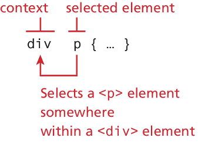

<!-- markdownlint-disable -->
# CSS Basics 2

As part of this lesson, we'll continue our lesson on CSS and discuss advance ways to apply CSS to our web pages.
## Table of Contents

- [CSS Basics 2](#css-basics-2)
  - [Table of Contents](#table-of-contents)
  - [CSS Selectors](#css-selectors)
    - [Element selectors](#element-selectors)
    - [Decendant Selector](#decendant-selector)
    - [Class Selector](#class-selector)
    - [ID Selector](#id-selector)
    - [Class \& ID in Action](#class--id-in-action)
  - [Cascade in CSS](#cascade-in-css)
    - [Inheritance](#inheritance)
    - [Specificity](#specificity)
    - [Location](#location)
  - [Background CSS](#background-css)
    - [Background colors](#background-colors)
    - [Background Image](#background-image)
  - [Borders \& Box Shadows](#borders--box-shadows)
    - [Border Width Measurements](#border-width-measurements)


The videos below provide an overview of the topics for this week. You can watch the videos before or after reading the content for this week.

<!-- Inline CSS -->
<iframe class="embedly-card" width="560" height="315" src="https://www.youtube.com/embed/TZTaGTQKl2I?si=hpIpHAJxFQg1kLBz" title="YouTube video player" frameborder="0" allow="accelerometer; autoplay; clipboard-write; encrypted-media; gyroscope; picture-in-picture; web-share" referrerpolicy="strict-origin-when-cross-origin" allowfullscreen></iframe>

<!-- All 3 ways of adding CSS -->
<!-- <iframe width="560" height="315" src="https://www.youtube.com/embed/WF8Ai6-JsNI?si=fz5Dsu_tivSYTFM-" title="YouTube video player" frameborder="0" allow="accelerometer; autoplay; clipboard-write; encrypted-media; gyroscope; picture-in-picture; web-share" referrerpolicy="strict-origin-when-cross-origin" allowfullscreen></iframe> -->

<!-- External CSS -->
<!-- <iframe width="560" height="315" src="https://www.youtube.com/embed/4OMdzHnys9o?si=p4uqupI0eRTqK2-K" title="YouTube video player" frameborder="0" allow="accelerometer; autoplay; clipboard-write; encrypted-media; gyroscope; picture-in-picture; web-share" referrerpolicy="strict-origin-when-cross-origin" allowfullscreen></iframe> -->

<!-- CSS Validation -->
<!-- <iframe width="560" height="315" src="https://www.youtube.com/embed/5tzE2Je3Y10?si=4rpndp3NUMJezgNf" title="YouTube video player" frameborder="0" allow="accelerometer; autoplay; clipboard-write; encrypted-media; gyroscope; picture-in-picture; web-share" referrerpolicy="strict-origin-when-cross-origin" allowfullscreen></iframe> -->

## CSS Selectors

- When defining CSS rules, you will need to use a selector.
- Selectors tell the browser which elements will be affected by the property values
- Selectors allow you to select individual or multiple HTML elements.
- Three basic selector types have been around since the earliest CSS2 specification.    
  - Element Selectors
  - Class Selectors
  - Id Selectors

### Element selectors
- Element selectors select all instances of a given HTML element.
- You can also select all elements by using the universal element selector `*`
- You can select a group of elements by separating the different element names with commas.

<!-- TODO Example -->


```css
/* commas allow you to group selectors */
p, div, footer {
  color: blue;
  font-size: 1.25em;
}

/* the above single grouped selector is equivalent to the following: */
p {
  color: blue;
  font-size: 1.25em;
}
div {
  color: blue;
  font-size: 1.25em;
}
footer {
  color: blue;
  font-size: 1.25em;
}	
```

### Decendant Selector




### Class Selector

- A class selector allows you to simultaneously target different HTML elements regardless of their position in the document tree.
- HTML elements labeled with the same class attribute value, can be targeted for styling by using a class selector, which takes the form: 
  - period `.` followed by the class name: `.blue-circle`
- Class selectors should not have any spaces, instead, you can use the following to concactinate 2 words together:
  - Dash: `.blue-circle`
  - Underscore: `.blue_cricle`
  - Camelcase: `.blueCircle` 

### ID Selector
- An ID selector allows you to target a specific element by its id attribute regardless of its type or position in the document tree.
- HTML elements labeled with an id attribute, can be targeted for styling by using an id selector, which takes the form: 
  - pound/hashtag `#` followed by the id name: `#orange-box`
  - Similar to classes, ID selectors should not have any spaces, instead, you can use the following to concactinate 2 words together:
  - Dash: `#orange-box`
  - Underscore: `#orange_box`
  - Camelcase: `.orangeBox` 

### Class & ID in Action

Example: The original HTML can be modified to add class and id values, which are then styled in CSS.
  - Id selector `#first` matches the `div` with id `first`
  - Class selectors `.orange` and `.circle`, match all divs with those class values
  - Notice that an element can be tagged with multiple classes. 


## Cascade in CSS 

The “Cascade” in CSS refers to how conflicting rules are handled. You can think of cascade as a mountain stream that progresses its way from the top of the mountain goes over various rocks along its way. 

- CSS uses the following cascade principles to help it deal with conflicts: 
  - Inheritance
  - Specificity
  - Location


### Inheritance

- Inheritance is the principle that many CSS properties affect their descendants as well as themselves.
  - Font, color, list, and text properties  are inheritable; 
  - Layout, sizing, border, background, and spacing properties are not.
  - it is also possible to inherit properties that are normally not inheritable using inherit

The examples below demonstrates this relationship. 


### Specificity

- Specificity is how the browser determines which style rule takes precedence when more than one style rule could be applied.
  - The more specific selector takes precedence i.e., overrides the previous definition.
  - Class selectors take precedence over element selectors, and id selectors take precedence over class selectors

Example: `<body>` color and font-weight properties are overridden by the more specific `<div>` and `<p>` selectors. 


### Location

- When inheritance and specificity cannot determine style precedence, the principle of location will be used.
- When rules have the same specificity, then the latest are given more weight.
- For instance, an [inline style](week-5-2.md#inline-css) will override one defined in an [external style](week-5-2.md#external-css) or an [internal/embedded style](week-5-2.md#internalembedded-css).

> [!NOTE]
> In case the same [style property](week-5-2.md#css-syntax-properties) is defined multiple times within a single declaration block, the last one will take precedence. 


## Background CSS

- the background of an element fills an element out to its border (if it has one, that is)
 
Common background properties:

- [background](https://www.w3schools.org/)
- [background-attachment](https://www.w3schools.org/)
- [background-color](https://www.w3schools.org/)
- [background-image](https://www.w3schools.org/)
- [background-orgin](https://www.w3schools.org/)
- [background-position](https://www.w3schools.org/)
- [background-repeat](https://www.w3schools.org/)
- [background-size](https://www.w3schools.org/)


### Background colors

- Sets the background color of the element

### Background Image

- Specifies the background image (which is generally a jpeg, gif, or png file) for the element. **Note that the URL is relative to the CSS file and not the HTML**

## Borders & Box Shadows

Borders and shadows provide a way to visually separate elements. You can put borders around all 4 sides of an element, or just 1, 2, or 3 of the sides. 

The box-shadow property provides a way to add shadow effects around an element’s box. To set the shadow, you specify x and y offsets, along with optional blur, spread, inset, and color settings.

Here are some various border and shadow properties:

- border
- border-style
- border-width
- border-color
- border-radius
- border-image
- box-shadow


 
### Border Width Measurements

Border widths are perhaps the one exception to the general advice against using the pixel measure. Using em units or percentages for border widths can result in unpredictable widths as the different browsers use different algorithms (some round up, some round down) as the zoom level increases or decreases. For this reason, border widths are almost always set to pixel units.

