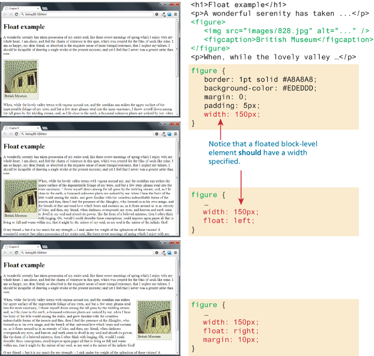
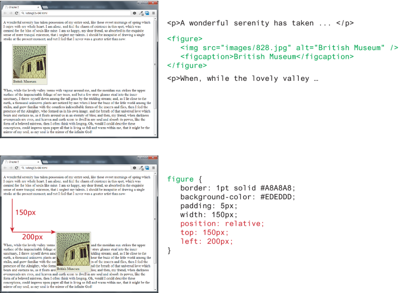

<!-- markdownlint-disable -->
# CSS Page Layout

As part of this lesson, we'll continue our lesson on CSS and discuss advance ways to apply CSS to our web pages.
## Table of Contents

<!-- toc -->

- [CSS Basics 2](#css-basics-2)
  - [Table of Contents](#table-of-contents)
  - [CSS Selectors](#css-selectors)
    - [Element selectors](#element-selectors)
    - [Decendant Selector](#decendant-selector)
    - [Class Selector](#class-selector)
    - [ID Selector](#id-selector)
    - [Class \& ID in Action](#class--id-in-action)
  - [Cascade in CSS](#cascade-in-css)
    - [Inheritance](#inheritance)
    - [Specificity](#specificity)
    - [Location](#location)

The videos below provide an overview of the topics for this week. You can watch the videos before or after reading the content for this week.

<!-- Margin Collapse -->
<iframe width="560" height="315" src="https://www.youtube.com/embed/eZJJPMwG5ec?si=4pPT7w1s3OphwVud" title="YouTube video player" frameborder="0" allow="accelerometer; autoplay; clipboard-write; encrypted-media; gyroscope; picture-in-picture; web-share" referrerpolicy="strict-origin-when-cross-origin" allowfullscreen></iframe>

## CSS Layout

- The display property in CSS provides a mechanism for the developer to change an element to block, inline, or inline-block.
- For the first 20 years of CSS, designers had to “hack” together multi column layouts using floats and/or positioning. There may be times when you may have to support legacy CSS so it makes sense to learn the basics of floats and positioning.
- Newer approaches (flexbox and grid display modes) make columnar layouts much easier to implement.

## Float

- It is possible to displace an element out of its position in the normal flow via the CSS **float property**
- An element can be floated to the `left` or floated to the `right` and content is “reflowed” around the floated element
- A floated block-level element should have a width specified

## Position Element

- The position property is used to specify the type of positioning. The left, right, top, and bottom properties are used to indicate the distance the element will move.
  - `absolute` The element is removed from normal flow and positioned in relation to its nearest positioned ancestor.
  - `fixed` The element is fixed in a specific position in the window even when the document is scrolled.
  - `relative` The element is moved relative to where it would be in the normal flow.
  - `static` The element is positioned according to the normal flow. This is the default.
  - `sticky` The element is positioned in according to the normal flow, and then offset relative to its nearest scrolling ancestor. This is used to allow an item to scroll, and then stay fixed in position once its scroll position is reached.

### Relative Positioning

## The Box Model

In CSS, all HTML elements exist within an element box (also known as the box model):

<!-- TODO: Add box model picture from slides here -->

### CSS Padding

- The padding property configures empty space between the content of the HTML element (such as text) and the border (0px by default).
- Related properties
  - `padding-top`, `padding-right`, `padding-bottom`, `padding-left`
  - `padding` is a shorthand property with values in the above order
